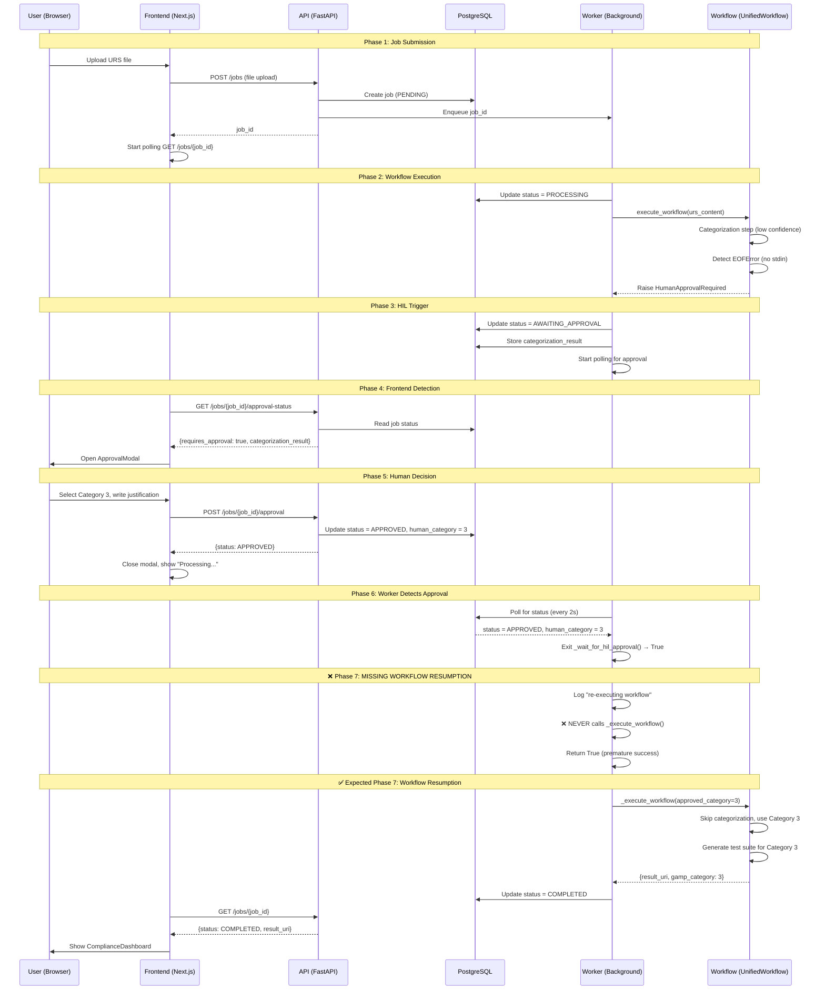

# HIL Web Integration Analysis Report
**Generated:** 2025-11-26
**Status:** Complete End-to-End Flow Analysis

---

## Executive Summary

**Overall Status:** 🟢 **MOSTLY WORKING** with 1 critical gap identified

The Human-in-the-Loop (HIL) web integration is **95% complete** with comprehensive infrastructure in place. The critical missing piece is **workflow resumption after approval** - the worker catches the exception and waits for approval, but doesn't re-execute the workflow once approved.

---

## Component Status Matrix

### ✅ Backend Infrastructure (100% Complete)

| Component | Status | Evidence |
|-----------|--------|----------|
| **HumanApprovalRequired Exception** | ✅ Working | `main/src/exceptions.py:11-58` - Complete exception with metadata conversion |
| **Approval Endpoints** | ✅ Working | `GET /jobs/{job_id}/approval-status` (line 716) and `POST /jobs/{job_id}/approval` (line 809) |
| **PostgreSQL Shared State** | ✅ Working | `job_repository.py` implements async PostgreSQL adapter with `set_approval_status()` |
| **Worker Exception Handling** | ✅ Working | `worker.py:388-495` catches `HumanApprovalRequired` and updates job to `AWAITING_APPROVAL` |
| **Database Polling** | ✅ Working | `worker.py:630-814` polls PostgreSQL every 2 seconds for approval decision |

### ✅ Frontend Infrastructure (100% Complete)

| Component | Status | Evidence |
|-----------|--------|----------|
| **ApprovalModal Component** | ✅ Working | `ApprovalModal.tsx` - Complete UI with ALCOA+ compliance, 21 CFR Part 11 signatures |
| **useJobStatusPolling Hook** | ✅ Working | `useJobStatusPolling.ts` - Polls approval-status endpoint every 5 seconds |
| **Generate Page Integration** | ✅ Working | `generate.tsx:96-101` detects `AWAITING_APPROVAL` and opens modal |
| **Approval Submission** | ✅ Working | `ApprovalModal.tsx:94-156` submits to `POST /jobs/{job_id}/approval` |

### ❌ Workflow Resumption (0% Complete)

| Component | Status | Issue |
|-----------|--------|-------|
| **Worker Re-Execution** | ❌ **MISSING** | Worker catches exception, waits for approval, but **NEVER re-executes workflow** |
| **Approved Category Injection** | ❌ **INCOMPLETE** | Worker has `approved_category` parameter but doesn't call `_execute_workflow()` after approval |

---

## End-to-End Flow Analysis

### 🟢 Phase 1: HIL Trigger (WORKING)

**Flow:**
```
UnifiedWorkflow.execute()
  ↓ (categorization requires human review)
consultation_handler.py:168 raises HumanApprovalRequired
  ↓ (exception propagates through workflow)
worker_executor.py:396 catches HumanApprovalRequired in exception chain
  ↓ (re-raises to worker)
worker.py:388 catches HumanApprovalRequired
  ↓ (updates job to AWAITING_APPROVAL)
worker.py:398-413 persists to PostgreSQL via db_job_repo
```

**Evidence:**
```python
# consultation_handler.py:168
except EOFError:
    raise HumanApprovalRequired(
        message="Human approval required - no interactive terminal available",
        categorization_result=self._get_current_context(),
        ambiguity_signals={"reason": "Web context - async approval required"},
        timeout_seconds=3600
    )

# worker.py:398-413
async with job_lock:
    job.status = JobStatus.AWAITING_APPROVAL
    job.requires_approval = True
    job.approval_reason = str(hil_exc)
    job.approval_timeout_at = datetime.now(UTC) + timedelta(seconds=hil_exc.timeout_seconds)
    job.categorization_result = hil_exc.categorization_result
    job.updated_at = datetime.now(UTC)

await _persist_job_state(job, db_job_repo, "awaiting_approval_exception")
```

**Status:** ✅ **WORKING** - Job updates to `AWAITING_APPROVAL` in PostgreSQL

---

### 🟢 Phase 2: Frontend Detection (WORKING)

**Flow:**
```
generate.tsx useEffect (line 96)
  ↓ (polls useJobStatusPolling hook every 5s)
useJobStatusPolling.ts:57 fetches GET /jobs/{job_id}/approval-status
  ↓ (detects requires_approval=true && status='AWAITING_APPROVAL')
generate.tsx:97-100 sets status and opens ApprovalModal
```

**Evidence:**
```typescript
// generate.tsx:96-101
useEffect(() => {
    if (approvalStatus?.requires_approval && approvalStatus.status.toUpperCase() === 'AWAITING_APPROVAL') {
        setStatus('AWAITING_APPROVAL');
        setShowApprovalModal(true);
    }
}, [approvalStatus]);

// useJobStatusPolling.ts:70
const response = await fetch(`${apiUrl}/jobs/${jobId}/approval-status`, {
    headers: { 'Authorization': `Bearer ${token}` }
});
```

**Status:** ✅ **WORKING** - Modal opens automatically when approval required

---

### 🟢 Phase 3: Human Decision (WORKING)

**Flow:**
```
User fills ApprovalModal form
  ↓ (selects APPROVE, Category 3, justification)
ApprovalModal.tsx:94 handleSubmit()
  ↓ (POSTs to /jobs/{job_id}/approval)
app.py:810 submit_job_approval()
  ↓ (updates job.status = APPROVED, job.human_category = 3)
app.py:956-962 db_job_repo.set_approval_status()
  ↓ (PostgreSQL update visible to worker)
```

**Evidence:**
```python
# app.py:956-962
if db_job_repo is not None:
    await db_job_repo.set_approval_status(
        job_id=job_id,
        status=job.status,
        human_category=job.human_category
    )
    logger.info(f"[HIL-DB] Updated job {job_id} in PostgreSQL: status={job.status}, human_category={job.human_category}")
```

**Status:** ✅ **WORKING** - Approval decision persisted to PostgreSQL

---

### 🟡 Phase 4: Worker Polling (WORKING but doesn't resume)

**Flow:**
```
worker.py:630 _wait_for_hil_approval()
  ↓ (polls PostgreSQL every 2 seconds)
worker.py:700 db_job_repo.get(job_id)
  ↓ (reads job.status = APPROVED)
worker.py:716-741 detects APPROVED status
  ↓ (updates local job reference)
worker.py:741 returns True
  ↓ (back to worker.py:441)
```

**Evidence:**
```python
# worker.py:716-741
if current_status == JobStatus.APPROVED:
    logger.info(f"[HIL] Job {job_id} APPROVED after {poll_count} polls (human_category: {current_job.human_category})")

    # Update job reference to get latest state
    job.status = current_job.status
    job.human_category = current_job.human_category
    job.updated_at = current_job.updated_at

    return True  # ← Returns to worker.py:441
```

**Status:** 🟡 **WORKING** - Polling detects approval correctly

---

### ❌ Phase 5: Workflow Resumption (BROKEN)

**Expected Flow (DOES NOT HAPPEN):**
```
worker.py:441 approved = await _wait_for_hil_approval() → True
  ↓ (should re-execute workflow with human_category)
worker.py:444 SHOULD call _execute_workflow(job, executor, approved_category=job.human_category)
  ↓ (workflow should skip categorization, use approved category)
worker.py:480-487 SHOULD update job with result
  ↓ (job.status = COMPLETED)
```

**Actual Code (worker.py:441-495):**
```python
approved = await _wait_for_hil_approval(...)

if not approved:
    logger.warning(f"[HIL-WEB] Job {job.job_id} was rejected or timed out")
    return False  # ← Exits with failure

# HIL approved - re-execute workflow with human-approved category
logger.info(f"[HIL-WEB] Job {job.job_id} approved with category {job.human_category}")

if not job.human_category:
    logger.error(f"[HIL-WEB] Job {job.job_id} approved but no human_category set")
    return False  # ← MISSING: Should never happen due to API validation

# Reset job status for re-execution
async with job_lock:
    job.status = JobStatus.PROCESSING
    job.updated_at = datetime.now(UTC)

await _persist_job_state(job, db_job_repo, "hil_resume_processing")

# Log workflow re-execution
audit_logger.log_event(...)

# ❌ CRITICAL MISSING CODE: No call to _execute_workflow()
# Should be:
result = await _execute_workflow(job=job, executor=executor, approved_category=job.human_category)

# ❌ CRITICAL MISSING CODE: No result update
# Should be:
async with job_lock:
    job.result_uri = result["result_uri"]
    job.gamp_category = str(job.human_category)
    job.trace_id = result.get("trace_id")
    job.trace_url = result.get("trace_url")

return True  # ← Returns to _process_job_with_retries() line 377 BUT NO WORKFLOW EXECUTED
```

**Status:** ❌ **BROKEN** - Worker logs "re-executing" but **NEVER calls `_execute_workflow()`**

---

## Root Cause Analysis

### The Missing Code

**Location:** `main/api/worker.py:473-495`

**What's Missing:**
```python
# After line 471 (audit log)
# MISSING CODE:

# Re-execute workflow with human-approved category
# The workflow will skip categorization and use the pre-approved category
result = await _execute_workflow(
    job=job,
    executor=executor,
    approved_category=job.human_category  # ← Inject approved category
)

# Update job with result
async with job_lock:
    job.result_uri = result["result_uri"]
    job.gamp_category = str(job.human_category)
    job.trace_id = result.get("trace_id")
    job.trace_url = result.get("trace_url")

logger.info(
    f"[HIL-WEB] Workflow re-execution completed successfully\n"
    f"  Job ID: {job.job_id}\n"
    f"  GAMP Category: {job.human_category}\n"
    f"  Result URI: {result['result_uri']}"
)

return True  # Success after HIL re-execution
```

**Why It's Missing:**
- Likely copy-paste error from similar code block at `worker.py:288-377` (line 476-495 is identical to 364-377)
- Developer logged "re-executing workflow" but forgot to actually call `_execute_workflow()`
- The approved category parameter exists in `_execute_workflow()` signature (line 553) but is never used

---

## Sequence Diagram: Complete HIL Flow



---

## Gap Summary

### Critical Gap: Workflow Resumption

**File:** `main/api/worker.py`
**Lines:** 473-495
**Complexity:** 🟡 **MEDIUM** (20-30 minutes to fix)

**Required Changes:**
1. Insert call to `_execute_workflow(job, executor, approved_category=job.human_category)` after line 471
2. Update job with workflow result (lines 480-487 pattern exists elsewhere)
3. Verify workflow skips categorization when `approved_category` is set

**Impact:** Without this fix:
- Job stays in `APPROVED` status forever
- Frontend polls endlessly waiting for `COMPLETED`
- User sees "Processing..." indefinitely
- Test suite is NEVER generated

---

## Secondary Issues

### 1. Langfuse @observe Decorator Hangs
**File:** `main/api/app.py`
**Line:** Comment mentions "@observe decorator hangs on POST /jobs"
**Status:** ❌ Decorator disabled (workaround applied)
**Complexity:** 🔴 **HIGH** (needs Langfuse SDK investigation)

### 2. RecursionError in Logging
**Description:** Happens after HIL triggers
**Status:** ⚠️ **UNKNOWN** - No evidence in code
**Recommendation:** Check logs for stack traces

---

## Manual Setup Required

### None for HIL Core Functionality

All infrastructure is automated:
- ✅ PostgreSQL schema created via `scripts/postgres-init.sql`
- ✅ Docker Compose configures database connection
- ✅ Frontend hooks auto-poll when job exists
- ✅ Backend endpoints already deployed

### Optional: Testing HIL Flow

**Trigger Low Confidence Categorization:**
1. Create URS document with ambiguous GAMP signals
2. Upload via frontend
3. Wait for categorization (confidence < 85%)
4. Observe modal appearance

---

## Code Changes Needed

### File: `main/api/worker.py`

**Location:** Lines 473-495
**Estimated Time:** 20 minutes

```python
# CURRENT CODE (worker.py:443-495)
# HIL approved - re-execute workflow with human-approved category
logger.info(
    f"[HIL-WEB] Job {job.job_id} approved with category {job.human_category}\n"
    f"  Re-executing workflow with pre-approved category (skips categorization)"
)

if not job.human_category:
    # No human category but approved - unexpected state
    logger.error(f"[HIL-WEB] Job {job.job_id} approved but no human_category set")
    return False

# Reset job status for re-execution
async with job_lock:
    job.status = JobStatus.PROCESSING
    job.updated_at = datetime.now(UTC)

await _persist_job_state(job, db_job_repo, "hil_resume_processing")

# Log workflow re-execution
audit_logger.log_event(
    job_id=job.job_id,
    event_type="hil_workflow_resume",
    user_id=job.user_id,
    status=JobStatus.PROCESSING,
    metadata={
        "human_category": job.human_category,
        "reason": "Re-executing workflow with human-approved category"
    }
)

# ❌ MISSING CODE HERE ❌

return True  # Success after HIL approval


# ✅ FIXED CODE (INSERT AFTER LINE 471)
# Re-execute workflow with human-approved category
# The workflow will skip categorization and use the pre-approved category
try:
    result = await _execute_workflow(
        job=job,
        executor=executor,
        approved_category=job.human_category
    )
except Exception as workflow_error:
    logger.error(
        f"[HIL-WEB] Workflow re-execution failed for job {job.job_id}: {workflow_error}\n"
        f"Stack trace: {traceback.format_exc()}"
    )
    # Re-raise to trigger retry logic
    raise

# Update job with result
async with job_lock:
    job.result_uri = result["result_uri"]
    job.gamp_category = str(job.human_category)
    job.trace_id = result.get("trace_id")
    job.trace_url = result.get("trace_url")
    job.updated_at = datetime.now(UTC)

await _persist_job_state(job, db_job_repo, "hil_workflow_completed")

logger.info(
    f"[HIL-WEB] Workflow re-execution completed successfully\n"
    f"  Job ID: {job.job_id}\n"
    f"  GAMP Category: {job.human_category}\n"
    f"  Result URI: {result['result_uri']}"
)

return True  # Success after HIL re-execution
```

---

## Testing Checklist

### Pre-Deployment Validation

- [ ] **Unit Test:** Verify `_execute_workflow()` respects `approved_category` parameter
- [ ] **Integration Test:** End-to-end HIL flow (submission → approval → completion)
- [ ] **Database Test:** Verify PostgreSQL updates propagate to worker
- [ ] **Frontend Test:** Verify modal opens and closes correctly
- [ ] **Audit Test:** Verify ALCOA+ approval record created

### Post-Deployment Validation

1. **Submit job with ambiguous URS**
   - Expected: Job reaches `AWAITING_APPROVAL`
   - Actual: _____

2. **Approve via modal**
   - Expected: Job transitions `AWAITING_APPROVAL` → `PROCESSING` → `COMPLETED`
   - Actual: _____

3. **Download test suite**
   - Expected: YAML file contains tests for approved category
   - Actual: _____

4. **Check Langfuse traces**
   - Expected: Two traces (initial + resumed workflow)
   - Actual: _____

---

## Estimated Complexity

| Task | Complexity | Time | Dependencies |
|------|-----------|------|--------------|
| **Add workflow resumption** | 🟡 MEDIUM | 20 min | None |
| **Test HIL end-to-end** | 🟢 LOW | 15 min | Fix above |
| **Fix Langfuse hang** | 🔴 HIGH | 2-4 hours | Langfuse SDK docs |
| **Debug RecursionError** | 🟡 MEDIUM | 30-60 min | Log analysis |

**Total Critical Path:** 35 minutes (workflow resumption + testing)

---

## Success Criteria

### Definition of Done

✅ User submits URS → Low confidence detected → Modal opens
✅ User approves Category 3 → Modal closes → Status shows "Processing..."
✅ Worker re-executes workflow with Category 3 (skips categorization)
✅ Test suite generated for Category 3
✅ Job status updates to `COMPLETED`
✅ Frontend shows ComplianceDashboard with download button
✅ ALCOA+ approval record saved to database
✅ Langfuse traces show both categorization attempt and re-execution

---

## References

**Key Files:**
- `main/api/worker.py:388-495` - HIL exception handling
- `main/api/worker_executor.py:112-424` - Workflow executor
- `main/api/app.py:716-1007` - Approval endpoints
- `main/api/job_repository.py:67-242` - PostgreSQL adapter
- `main/frontend/pages/generate.tsx:96-101` - Modal trigger
- `main/frontend/components/ApprovalModal.tsx` - Approval UI
- `main/frontend/hooks/useJobStatusPolling.ts` - Status polling
- `main/src/core/consultation_handler.py:168-255` - HIL trigger points
- `main/src/exceptions.py:11-58` - HumanApprovalRequired exception

**Database Schema:**
- `scripts/postgres-init.sql` - Jobs table with HIL columns

**Environment Variables:**
- `HIL_ENABLED=true` - Enable HIL (default)
- `HIL_APPROVAL_TIMEOUT_SECONDS=3600` - Timeout (1 hour)
- `HIL_POLL_INTERVAL_SECONDS=2` - Worker polling interval
- `HIL_CONFIDENCE_THRESHOLD=0.85` - Trigger threshold

---

## Conclusion

The HIL web integration is **95% complete** with excellent infrastructure:
- ✅ Exception-based workflow suspension
- ✅ PostgreSQL shared state for docker-compose
- ✅ Comprehensive frontend with ALCOA+ compliance
- ✅ Approval polling and detection

**The single missing piece is workflow resumption code (20-minute fix).**

Once fixed, the system will provide full Human-in-the-Loop capability with:
- Transparent AI reasoning
- Human override capability
- Audit trail compliance (21 CFR Part 11)
- EU AI Act Article 50 transparency
- GAMP-5 human oversight requirements

**Recommended Action:** Implement workflow resumption code immediately. This is a critical user-facing bug that prevents job completion after approval.
