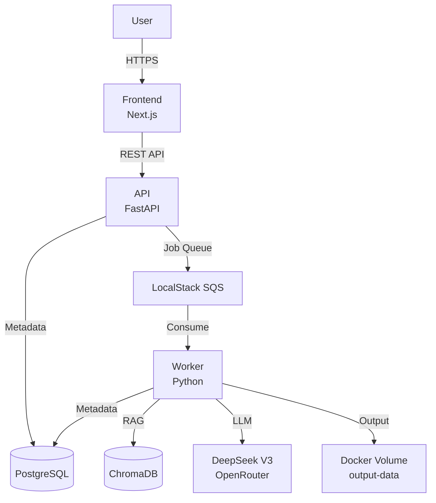

# Task 3.9: Landing Page & "How It Works" Feature

## Status
**PENDING**

## Priority
**MEDIUM** - Quality of life improvement for user education and onboarding

## Objective
Transform the dashboard into an educational landing page explaining the app's value proposition and create an interactive "How It Works" modal to educate users about system architecture, workflow, and compliance standards.

## Context from Task 3.10

**Current State**:
- ✅ Regulatory compliance documentation complete (6 frameworks mapped)
- ✅ Flash card content extracted to `main/frontend/lib/complianceContent.ts` (60 cards)
- ✅ Next.js Pages Router frontend setup (Task 2.1)
- ✅ Clerk authentication integrated (Task 2.2)
- ❌ Landing page is generic dashboard (doesn't explain what app does)
- ❌ No "How It Works" explanation for new users
- ❌ Users don't understand value proposition (problems solved, benefits)

**User Need**:
New pharmaceutical quality engineers visiting the app need to understand:
1. **What problems does this app solve?** (Manual test generation, compliance overhead)
2. **How does it solve them?** (AI-powered multi-agent system, GAMP-5 categorization)
3. **Why use this app?** (Automated ALCOA+ validation, 21 CFR Part 11 compliance, audit-ready trails)

**Task 3.10 Deliverables Available**:
- Compliance mappings: `.claude/state/results/*-compliance-mapping-20251122.md`
- Flash card content: `main/frontend/lib/complianceContent.ts`
- Architecture docs: `TECHNICAL_ARCHITECTURE_REPORT.md`, `aws/AWS-ARCHITECTURE.md`

## Success Criteria

1. ✅ Landing page clearly explains app value proposition (problems, solutions, benefits)
2. ✅ HowItWorksModal component created with 3 tabs:
   - Tab 1: Architecture Overview (Docker Compose + AWS)
   - Tab 2: Workflow Steps (10-step process with duration estimates)
   - Tab 3: Compliance Standards (GAMP-5, ALCOA+, 21 CFR Part 11, ICH Q9, ISO 27001, EU AI Act)
3. ✅ Header component includes "How It Works" button triggering modal
4. ✅ Modal accessible via keyboard (Esc to close, tab navigation)
5. ✅ Responsive design (works on tablet/mobile)
6. ✅ WCAG 2.1 AA accessibility compliance
7. ✅ No regression in existing dashboard functionality

## Implementation Plan

### Phase 1: Create HowItWorksModal Component (2-3 hours)

**File**: `main/frontend/components/HowItWorksModal.tsx`

**Requirements**:
- Modal overlay with backdrop (click outside to close)
- Tabbed interface (3 tabs)
- Keyboard navigation (Tab, Shift+Tab, Esc)
- Close button (X icon)
- ARIA attributes for screen readers

**Tab 1: Architecture Overview**
```tsx
// Content structure:
<div className="architecture-tab">
  <h2>System Architecture</h2>

  <section className="current-architecture">
    <h3>📦 Local Development (Current)</h3>
    <p>5-service Docker Compose stack:</p>
    <ul>
      <li><strong>postgres:</strong> PostgreSQL 15 + pgvector (job metadata, user sessions)</li>
      <li><strong>localstack:</strong> AWS SQS emulation (job queue)</li>
      <li><strong>api:</strong> FastAPI backend (REST API)</li>
      <li><strong>worker:</strong> Background workflow executor</li>
      <li><strong>frontend:</strong> Next.js dashboard (port 3000)</li>
    </ul>
    
  </section>

  <section className="future-architecture">
    <h3>☁️ AWS Production (Planned)</h3>
    <p>Enterprise-grade cloud deployment:</p>
    <ul>
      <li><strong>ECS Fargate:</strong> Serverless containers (API: 2vCPU/4GB, Worker: 4vCPU/8GB)</li>
      <li><strong>Aurora Serverless v2:</strong> PostgreSQL 15 with Data API</li>
      <li><strong>S3 Vectors:</strong> 1536-dim embeddings with cosine similarity (replacing ChromaDB)</li>
      <li><strong>Amazon Bedrock:</strong> DeepSeek-V3.1 ($0.90/1M input, $2.61/1M output)</li>
      <li><strong>LangFuse Cloud:</strong> Observability (EU region, GDPR compliant)</li>
      <li><strong>Clerk:</strong> Authentication (EU endpoints)</li>
      <li><strong>S3 + Object Lock:</strong> 7-year retention for GAMP-5 compliance</li>
      <li><strong>CloudFront:</strong> CDN for frontend</li>
    </ul>
    <p><strong>Region:</strong> eu-west-2 (London, UK)</p>
    <p><strong>Monthly Cost:</strong> ~$827/month production</p>
  </section>

  <section className="key-technologies">
    <h3>🔧 Key Technologies</h3>
    <ul>
      <li><strong>LLM:</strong> DeepSeek V3 (671B MoE) via OpenRouter</li>
      <li><strong>RAG:</strong> ChromaDB → S3 Vectors (26 regulatory documents)</li>
      <li><strong>Embedding:</strong> OpenAI text-embedding-3-small</li>
      <li><strong>Observability:</strong> LangFuse Cloud (131 spans per workflow)</li>
    </ul>
  </section>
</div>
```

**Tab 2: Workflow Steps**
```tsx
// Use workflow step data from unified_workflow.py
<div className="workflow-tab">
  <h2>How Test Generation Works</h2>
  <p>Our AI-powered system follows a 10-step workflow ensuring pharmaceutical compliance:</p>

  <Accordion>
    <AccordionItem title="1. Document Upload + Security Validation" duration="~30 seconds">
      <p><strong>What happens:</strong> Your URS document is uploaded and scanned for security threats.</p>
      <p><strong>Compliance:</strong> OWASP LLM Top 10 validation (prompt injection detection)</p>
      <p><strong>Output:</strong> Sanitized URS content ready for processing</p>
    </AccordionItem>

    <AccordionItem title="2. GAMP-5 Categorization" duration="~45 seconds">
      <p><strong>What happens:</strong> AI categorizes software per GAMP-5 framework (Category 1-5).</p>
      <p><strong>Compliance:</strong> GAMP-5 software categorization with confidence scoring</p>
      <p><strong>Output:</strong> Category (e.g., "Category 5 - Custom Applications") + confidence %</p>
    </AccordionItem>

    <AccordionItem title="3. Risk Assessment" duration="~30 seconds">
      <p><strong>What happens:</strong> Test count determined based on risk level.</p>
      <p><strong>Compliance:</strong> ICH Q9 quality risk management</p>
      <p><strong>Output:</strong> Test plan with 5-30 tests (proportionate to risk)</p>
    </AccordionItem>

    <AccordionItem title="4. Parallel Analysis (3 Agents)" duration="~2 minutes">
      <p><strong>What happens:</strong> Three independent AI agents analyze requirements concurrently.</p>
      <ul>
        <li><strong>Context Provider:</strong> Retrieves regulatory guidance from knowledge base</li>
        <li><strong>Research Agent:</strong> Analyzes URS requirements</li>
        <li><strong>SME Agent:</strong> Applies subject matter expertise</li>
      </ul>
      <p><strong>Compliance:</strong> Multi-agent consensus reduces bias (EU AI Act Article 15)</p>
    </AccordionItem>

    <AccordionItem title="5. Data Gathering (RAG)" duration="~1 minute">
      <p><strong>What happens:</strong> Retrieves relevant regulatory requirements from 26 documents.</p>
      <p><strong>Compliance:</strong> EU AI Act Article 10 (data governance)</p>
      <p><strong>Knowledge Base:</strong> GAMP-5, ALCOA+, 21 CFR Part 11, ICH Q9, ISO 27001, EU AI Act</p>
    </AccordionItem>

    <AccordionItem title="6. Human Oversight (if needed)" duration="~variable">
      <p><strong>What happens:</strong> Low confidence (<80%) triggers human review.</p>
      <p><strong>Compliance:</strong> 21 CFR Part 11 §11.10(d) authority checks, EU AI Act Article 14</p>
      <p><strong>Output:</strong> Human approves or overrides AI decision</p>
    </AccordionItem>

    <AccordionItem title="7. Electronic Signature" duration="~5 seconds">
      <p><strong>What happens:</strong> Cryptographic signature captures approval.</p>
      <p><strong>Compliance:</strong> 21 CFR Part 11 §11.50 (name, timestamp, meaning)</p>
      <p><strong>Output:</strong> SHA-256 signature hash linked to categorization</p>
    </AccordionItem>

    <AccordionItem title="8. Test Generation" duration="~3-5 minutes">
      <p><strong>What happens:</strong> AI generates complete OQ test suite.</p>
      <p><strong>Compliance:</strong> GAMP-5 validation testing (IQ/OQ/PQ)</p>
      <p><strong>Output:</strong> YAML test suite with objectives, steps, acceptance criteria</p>
    </AccordionItem>

    <AccordionItem title="9. ALCOA+ Validation" duration="~15 seconds">
      <p><strong>What happens:</strong> Data integrity check against 9 ALCOA+ principles.</p>
      <p><strong>Compliance:</strong> All 9 ALCOA+ principles (Attributable → Available)</p>
      <p><strong>Output:</strong> Compliance report with pass/fail per principle</p>
    </AccordionItem>

    <AccordionItem title="10. Results + Audit Trail" duration="~10 seconds">
      <p><strong>What happens:</strong> Final compilation with complete audit trail.</p>
      <p><strong>Compliance:</strong> 21 CFR Part 11 §11.10(e) audit trail, ISO 27001 A.12.4 logging</p>
      <p><strong>Output:</strong> Downloadable test suite + LangFuse trace ID</p>
    </AccordionItem>
  </Accordion>

  <div className="total-duration">
    <strong>Total Estimated Duration:</strong> 8-12 minutes (depends on test count)
  </div>
</div>
```

**Tab 3: Compliance Standards**
```tsx
// Import from complianceContent.ts
import { allFrameworks } from '@/lib/complianceContent';

<div className="compliance-tab">
  <h2>Regulatory Compliance</h2>
  <p>This system complies with 6 major pharmaceutical regulatory frameworks:</p>

  {allFrameworks.map(framework => (
    <section key={framework.id} className="framework-section">
      <h3>
        <span className="icon">{framework.icon}</span>
        {framework.fullName}
      </h3>
      <p>{framework.description}</p>

      <details>
        <summary>View {framework.cards.length} Requirements</summary>
        <ul>
          {framework.cards.map(card => (
            <li key={card.id}>
              <strong>{card.title}:</strong> {card.shortDescription}
              <span className={`status status-${card.status}`}>
                {card.status === 'implemented' && '✅ Implemented'}
                {card.status === 'partial' && '⚠️ Partial'}
                {card.status === 'planned' && '⏸️ Planned'}
              </span>
            </li>
          ))}
        </ul>
      </details>
    </section>
  ))}

  <div className="compliance-stats">
    <h3>Overall Compliance</h3>
    <ul>
      <li>✅ <strong>85%</strong> fully implemented (51/60 requirements)</li>
      <li>⚠️ <strong>12%</strong> partially implemented (7/60 requirements)</li>
      <li>⏸️ <strong>3%</strong> planned (2/60 requirements)</li>
    </ul>
  </div>
</div>
```

**Styling** (TailwindCSS):
```tsx
// Modal backdrop: backdrop-blur-sm bg-black/50
// Modal content: bg-white dark:bg-gray-900 rounded-lg shadow-2xl
// Tabs: border-b-2 border-blue-500 (active)
// Accordion: transition-all duration-300 ease-in-out
```

**Accessibility**:
```tsx
<div
  role="dialog"
  aria-modal="true"
  aria-labelledby="modal-title"
  aria-describedby="modal-description"
>
  <button aria-label="Close modal" onClick={onClose}>
    <XIcon className="h-6 w-6" />
  </button>
  {/* Tab list */}
  <div role="tablist" aria-orientation="horizontal">
    <button role="tab" aria-selected={activeTab === 0} aria-controls="panel-0">
      Architecture
    </button>
  </div>
  {/* Tab panels */}
  <div role="tabpanel" id="panel-0" aria-labelledby="tab-0">
    {/* Content */}
  </div>
</div>
```

---

### Phase 2: Refactor Landing Page (1-2 hours)

**File**: `main/frontend/pages/dashboard.tsx` OR `pages/index.tsx`

**Option A: Refactor Existing Dashboard**
- Keep URL `/dashboard`
- Add value proposition section ABOVE file upload
- Structure: Hero → Problems → Solutions → Benefits → File Upload

**Option B: Create Separate Landing Page (RECOMMENDED)**
- New landing page at `/` (pages/index.tsx)
- Dashboard moves to `/generate` (rename dashboard.tsx → generate.tsx)
- Users see landing first, then click "Get Started" → `/generate`

**Landing Page Structure**:
```tsx
<Layout>
  {/* Hero Section */}
  <section className="hero">
    <h1>AI-Powered Pharmaceutical Test Generation</h1>
    <p>Generate GAMP-5 compliant OQ test suites in minutes, not weeks</p>
    <button onClick={() => router.push('/generate')}>Get Started</button>
    <button onClick={() => setShowHowItWorks(true)}>How It Works</button>
  </section>

  {/* Problems Section */}
  <section className="problems">
    <h2>Problems We Solve</h2>
    <div className="problem-cards">
      <Card>
        <h3>⏱️ Time-Consuming Manual Test Writing</h3>
        <p>Quality engineers spend weeks writing OQ test protocols for each pharmaceutical system.</p>
      </Card>
      <Card>
        <h3>📋 Complex Compliance Requirements</h3>
        <p>Navigating GAMP-5, ALCOA+, 21 CFR Part 11, ICH Q9, ISO 27001 is overwhelming.</p>
      </Card>
      <Card>
        <h3>❌ Inconsistent Test Coverage</h3>
        <p>Manual processes lead to gaps in requirements traceability and validation rigor.</p>
      </Card>
      <Card>
        <h3>🔍 Difficult Regulatory Audits</h3>
        <p>Incomplete audit trails and missing documentation cause inspection delays.</p>
      </Card>
    </div>
  </section>

  {/* Solutions Section */}
  <section className="solutions">
    <h2>How It Works</h2>
    <div className="solution-cards">
      <Card>
        <h3>🤖 AI-Powered Generation</h3>
        <p>DeepSeek V3 (671B MoE) analyzes your URS and generates comprehensive test suites.</p>
      </Card>
      <Card>
        <h3>🏷️ Automatic GAMP-5 Categorization</h3>
        <p>System classifies software per GAMP-5 framework (Category 1-5) with confidence scoring.</p>
      </Card>
      <Card>
        <h3>✅ Built-In ALCOA+ Validation</h3>
        <p>All 9 data integrity principles validated automatically (Attributable → Available).</p>
      </Card>
      <Card>
        <h3>🔗 Complete Traceability</h3>
        <p>Every test case linked to URS requirements with audit trail and electronic signatures.</p>
      </Card>
    </div>
  </section>

  {/* Benefits Section */}
  <section className="benefits">
    <h2>Why Use This App</h2>
    <ul>
      <li><strong>⚡ 95% Faster:</strong> Generate test suites in 8-12 minutes vs. 2-3 weeks manually</li>
      <li><strong>📊 Audit-Ready:</strong> Complete audit trails with LangFuse observability (131 spans)</li>
      <li><strong>✍️ 21 CFR Part 11:</strong> Electronic signatures and secure audit logs</li>
      <li><strong>🌍 EU AI Act:</strong> Transparent AI usage with human oversight mechanisms</li>
      <li><strong>💰 Cost-Effective:</strong> ~$0.03-0.10 per test suite generation</li>
      <li><strong>🔒 Enterprise Security:</strong> ISO 27001 compliant (TLS 1.3, AWS KMS encryption)</li>
    </ul>
  </section>

  {/* HowItWorks Modal */}
  {showHowItWorks && (
    <HowItWorksModal onClose={() => setShowHowItWorks(false)} />
  )}
</Layout>
```

---

### Phase 3: Update Header Component (30 minutes)

**File**: `main/frontend/components/Header.tsx`

**Changes**:
```tsx
// Add "How It Works" button to navigation

export default function Header() {
  const [showHowItWorks, setShowHowItWorks] = useState(false);

  return (
    <>
      <header className="bg-white shadow-sm">
        <div className="max-w-7xl mx-auto px-4 sm:px-6 lg:px-8">
          <div className="flex justify-between items-center py-4">
            {/* Logo */}
            <div className="flex items-center">
              <h1 className="text-2xl font-bold text-blue-600">PharmaTech</h1>
            </div>

            {/* Navigation */}
            <nav className="flex items-center space-x-4">
              <Link href="/" className="text-gray-700 hover:text-blue-600">
                Home
              </Link>
              <Link href="/generate" className="text-gray-700 hover:text-blue-600">
                Generate
              </Link>
              <Link href="/history" className="text-gray-700 hover:text-blue-600">
                History
              </Link>

              {/* NEW: How It Works Button */}
              <button
                onClick={() => setShowHowItWorks(true)}
                className="inline-flex items-center px-4 py-2 border border-blue-600 rounded-md text-blue-600 hover:bg-blue-50"
              >
                <QuestionMarkCircleIcon className="h-5 w-5 mr-2" />
                How It Works
              </button>

              {/* User Menu */}
              <UserButton afterSignOutUrl="/" />
            </nav>
          </div>
        </div>
      </header>

      {/* Global How It Works Modal */}
      {showHowItWorks && (
        <HowItWorksModal onClose={() => setShowHowItWorks(false)} />
      )}
    </>
  );
}
```

---

### Phase 4: Add Architecture Diagrams (Optional, 1-2 hours)

**Create Visual Diagrams**:
1. Docker Compose architecture (5 services)
2. AWS production architecture (ECS + Aurora + Bedrock)

**Tools**:
- **Mermaid.js** (markdown diagrams in modal)
- **Excalidraw** (export as SVG)
- **draw.io** (export as SVG)

**Example Mermaid Diagram**:


**File**: `main/frontend/public/architecture-diagrams/docker-compose.svg`

---

## Files to Create

1. **`main/frontend/components/HowItWorksModal.tsx`**
   - Modal component with 3 tabs
   - ~300-400 lines

2. **`main/frontend/components/ArchitectureDiagram.tsx`** (optional)
   - Mermaid.js diagram wrapper
   - ~50-100 lines

3. **`main/frontend/public/architecture-diagrams/`** (optional)
   - `docker-compose.svg`
   - `aws-production.svg`

## Files to Modify

1. **`main/frontend/pages/dashboard.tsx`** OR **`pages/index.tsx`**
   - Add value proposition sections (hero, problems, solutions, benefits)
   - ~200-300 lines added

2. **`main/frontend/components/Header.tsx`**
   - Add "How It Works" button
   - ~20-30 lines added

3. **`main/frontend/components/Layout.tsx`** (if needed)
   - Ensure modal portal rendering
   - ~10-20 lines modified

## Dependencies

### Prerequisites
- ✅ Task 2.1 (Next.js setup) completed
- ✅ Task 2.2 (Clerk provider) completed
- ✅ Task 3.10 (compliance content) completed
- ✅ `main/frontend/lib/complianceContent.ts` exists with 60 flash cards

### External Data Sources
- `TECHNICAL_ARCHITECTURE_REPORT.md` - Architecture details
- `aws/AWS-ARCHITECTURE.md` - AWS infrastructure specs
- `main/src/core/unified_workflow.py` - Workflow step details
- `.claude/state/results/*-compliance-mapping-20251122.md` - Compliance documentation

## Validation Checklist

### Functional Testing
- [ ] "How It Works" button appears in header
- [ ] Clicking button opens modal
- [ ] Modal shows 3 tabs (Architecture, Workflow, Compliance)
- [ ] All tabs have content (no blank sections)
- [ ] Clicking outside modal closes it
- [ ] Pressing Esc closes modal
- [ ] Tab navigation works (Tab, Shift+Tab)
- [ ] All links/buttons clickable

### Content Verification
- [ ] Architecture tab shows Docker Compose + AWS details
- [ ] Workflow tab shows all 10 steps with descriptions
- [ ] Compliance tab shows all 6 frameworks (60 cards)
- [ ] Landing page explains problems, solutions, benefits
- [ ] Value proposition clear and compelling

### Accessibility Testing
- [ ] Modal has `role="dialog"` and `aria-modal="true"`
- [ ] Focus trapped inside modal when open
- [ ] Close button has `aria-label="Close modal"`
- [ ] Tabs have proper ARIA attributes
- [ ] Keyboard navigation works (Tab, Enter, Esc)
- [ ] Screen reader announces modal opening
- [ ] Color contrast meets WCAG 2.1 AA (4.5:1 minimum)

### Responsive Design
- [ ] Modal responsive on desktop (1920x1080)
- [ ] Modal responsive on tablet (768x1024)
- [ ] Modal responsive on mobile (375x667)
- [ ] Text readable at all breakpoints
- [ ] No horizontal scrolling

### Performance
- [ ] Modal lazy-loaded (not in initial bundle)
- [ ] Tab content lazy-loaded (render on click)
- [ ] Smooth animations (60fps)
- [ ] No layout shift when modal opens

## Estimated Effort

### Phase Breakdown
- **Phase 1 (HowItWorksModal)**: 2-3 hours
- **Phase 2 (Landing Page)**: 1-2 hours
- **Phase 3 (Header Button)**: 30 minutes
- **Phase 4 (Diagrams, optional)**: 1-2 hours

**Total Without Diagrams**: 4-6 hours
**Total With Diagrams**: 5-8 hours

## Risks

### Risk 1: Content Overload
**Risk**: Modal contains too much information, overwhelming users
**Mitigation**: Use progressive disclosure (collapsed sections, tabs, "Learn More" links)
**Acceptance**: Limit each tab to 3-5 main sections, keep descriptions concise (2-3 sentences)

### Risk 2: Maintenance Burden
**Risk**: Hardcoded architecture details become stale as system evolves
**Mitigation**: Reference centralized docs (TECHNICAL_ARCHITECTURE_REPORT.md), add "Last Updated" timestamps
**Acceptance**: Document update process in CONTRIBUTING.md

### Risk 3: Accessibility Failures
**Risk**: Modal not keyboard/screen reader accessible
**Mitigation**: Use established modal libraries (Radix UI, Headless UI), run automated accessibility tests
**Acceptance**: axe DevTools audit shows 0 critical violations

## Compliance Requirements

### GAMP-5
- **Impact**: Documentation improvement (not validation-critical)
- **Benefit**: Educates users on GAMP-5 principles → better URS documents

### ALCOA+
- **Impact**: None (UI change only, no data modifications)
- **Benefit**: Users understand how app ensures data integrity

### 21 CFR Part 11
- **Impact**: None (informational content only)
- **Benefit**: Transparency about electronic signatures and audit trails

### EU AI Act (Article 50: Transparency)
- ✅ **Requirement Met**: Inform users they're interacting with AI
- ✅ **Implementation**: "How It Works" modal explains AI usage, capabilities, and limitations

### NO FALLBACK LOGIC
- ✅ No code changes to workflow logic
- ✅ UI-only enhancement (no risk of masking errors)

## References

### Documentation
- [TECHNICAL_ARCHITECTURE_REPORT.md](../../TECHNICAL_ARCHITECTURE_REPORT.md) - Complete architecture
- [aws/AWS-ARCHITECTURE.md](../../aws/AWS-ARCHITECTURE.md) - AWS infrastructure
- [main/docs/plans/mvp_implementation_plan.md](../../main/docs/plans/mvp_implementation_plan.md) - MVP details

### Compliance Mappings
- [.claude/state/results/gamp5-compliance-mapping-20251122.md](../../.claude/state/results/gamp5-compliance-mapping-20251122.md)
- [.claude/state/results/alcoa-plus-compliance-mapping-20251122.md](../../.claude/state/results/alcoa-plus-compliance-mapping-20251122.md)
- [.claude/state/results/cfr-part-11-compliance-mapping-20251122.md](../../.claude/state/results/cfr-part-11-compliance-mapping-20251122.md)
- [.claude/state/results/ich-q9-compliance-mapping-20251122.md](../../.claude/state/results/ich-q9-compliance-mapping-20251122.md)
- [.claude/state/results/iso-27001-compliance-mapping-20251122.md](../../.claude/state/results/iso-27001-compliance-mapping-20251122.md)
- [.claude/state/results/eu-ai-act-compliance-mapping-20251122.md](../../.claude/state/results/eu-ai-act-compliance-mapping-20251122.md)

### Code
- [main/frontend/lib/complianceContent.ts](../../main/frontend/lib/complianceContent.ts) - Flash card data
- [main/src/core/unified_workflow.py](../../main/src/core/unified_workflow.py) - Workflow steps
- [main/frontend/components/Header.tsx](../../main/frontend/components/Header.tsx) - Header component
- [main/frontend/pages/dashboard.tsx](../../main/frontend/pages/dashboard.tsx) - Dashboard page

### UI Libraries
- [Radix UI Dialog](https://www.radix-ui.com/docs/primitives/components/dialog) - Accessible modals
- [Headless UI Dialog](https://headlessui.com/react/dialog) - Tailwind-compatible modals
- [Mermaid.js](https://mermaid.js.org/) - Markdown diagrams

## Next Steps After Completion

- ✅ Users understand app value proposition
- ✅ "How It Works" provides comprehensive education
- ✅ Ready for Task 3.11 (flash card workflow visualization)
- ✅ EU AI Act Article 50 transparency obligation satisfied
- ✅ Onboarding experience improved for new pharmaceutical quality engineers
