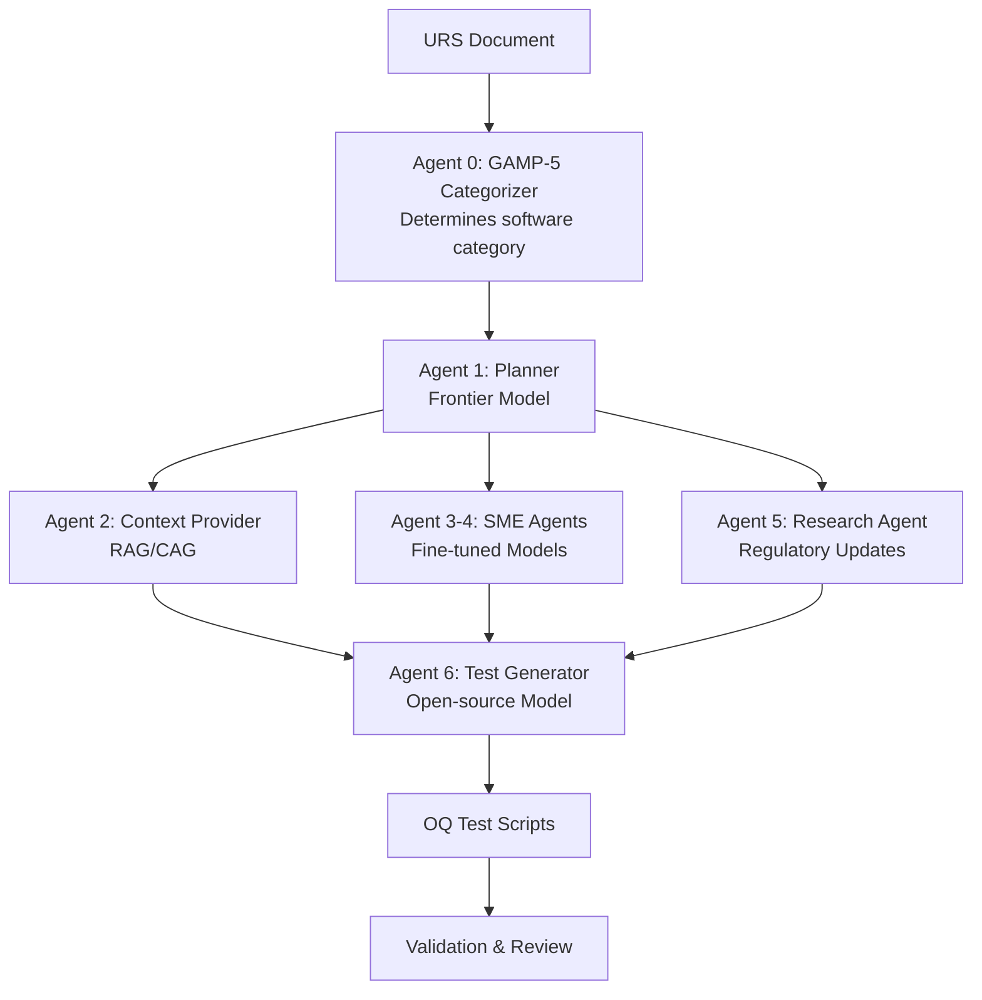

# 🧪 LLM-Driven Test Generation for Computerised System Validation

## 📚 Thesis Project Overview

This project implements a **multi-agent LLM system** for generating Operational Qualification (OQ) test scripts from User Requirements Specifications (URS) in the pharmaceutical/life sciences domain. It addresses the critical challenge of automating Computerised System Validation (CSV) while maintaining regulatory compliance and security.

**Research Title**: *Evaluating Efficiency Gains and Security of LLM-Driven Test Generation for Computerised System Validation: A Compliance-Focused Analysis of Life Sciences Testing Processes*

## 🎯 Project Goals

1. **Efficiency**: Achieve 70% reduction in test script generation time
2. **Compliance**: Ensure 100% adherence to GAMP 5 and 21 CFR Part 11
3. **Security**: Implement OWASP LLM Top 10 risk mitigation
4. **Quality**: Maintain ≥90% requirements coverage with <5% false positives

## 🏗️ Architecture

### Multi-Agent System Design



### Key Components

- **GAMP-5 Categorizer Agent**: Analyzes the URS to determine the GAMP 5 software category (e.g., Category 3, 4, or 5). This critical first step defines the scope and rigor of the entire validation process.
- **Planner Agent**: Orchestrates workflow using frontier model (GPT-4), informed by the software category
- **Context Agent**: Provides relevant documentation via RAG/CAG
- **Specialist Agents**: Domain-specific expertise (fine-tuned models)
- **Research Agent**: Fetches latest regulatory updates
- **Generator Agent**: Produces compliant test scripts tailored to the specific GAMP-5 category
- **Validation Layer**: ALCOA+ and security compliance checks

## 🚀 Quick Start

### Prerequisites

```bash
# Python 3.12+
python --version

# UV package manager
pip install uv

# Docker (for containerization)
docker --version
```

### Installation

```bash
# Clone repository
cd thesis_project

# Create virtual environment
uv venv
source .venv/bin/activate  # On Windows: .venv\Scripts\activate

# Install dependencies
uv pip install -e .

# Copy environment configuration
cp .env.example .env
# Edit .env with your API keys

# Initialize task management (already configured)
# Task-Master AI is pre-configured with Claude Sonnet 4.0
# Use MCP tools: mcp__task-master-ai__* for task management
```

### Basic Usage

```bash
# Run the test generation workflow
python -m src.main --urs-file path/to/urs.txt

# Interactive mode with Gradio UI
python -m src.main --interactive

# With monitoring
python -m phoenix.server.main serve &
python -m src.main --interactive --enable-monitoring
```

### Task Management (Claude Code)

This project uses Task-Master AI for intelligent project management:

```bash
# View all tasks and progress
mcp__task-master-ai__get_tasks

# Get next available task
mcp__task-master-ai__next_task

# Start working on a task
mcp__task-master-ai__set_task_status --id=1 --status=in-progress

# Log implementation progress
mcp__task-master-ai__update_subtask --id=1.1 --prompt="Implemented event validation logic"

# Research with project context
mcp__task-master-ai__research --query="LlamaIndex workflow patterns" --taskIds="3,4"

# Complete tasks
mcp__task-master-ai__set_task_status --id=1.1 --status=done
```

**Pre-configured Tasks:**
- 14 main tasks with dependencies following GAMP-5 implementation order
- 19+ subtasks for detailed implementation tracking
- Compliance-focused task breakdown (ALCOA+, 21 CFR Part 11)
- Research integration for regulatory best practices

## 🛠️ Development Workflow

### Integrated Development Approach

This project combines **Task-Master AI** for project management with **PRP Framework** for technical specifications:

#### Task-Master AI (Project Management)
```bash
# Daily workflow
mcp__task-master-ai__next_task                    # Get next task
mcp__task-master-ai__set_task_status --id=X --status=in-progress
mcp__task-master-ai__update_subtask --id=X.Y --prompt="Progress notes"
mcp__task-master-ai__set_task_status --id=X.Y --status=done

# Task management
mcp__task-master-ai__expand_task --id=X --research  # Break down complex tasks
mcp__task-master-ai__research --query="..." --taskIds="X,Y"  # Research integration
```

#### PRP Framework (Technical Specifications)
```bash
# For detailed technical guidance
/create-base-prp "Add ALCOA+ validation module"
/execute-base-prp PRPs/alcoa-validation.md
/review-staged-unstaged
```

**Usage Pattern:**
- **Task-Master**: Daily progress tracking, task dependencies, research
- **PRP**: Detailed technical specifications and implementation guidance
- **Integration**: Reference PRP details within task-master tasks

### Testing

```bash
# Run all validation gates
make validate

# Individual validation levels
uv run ruff check --fix        # Level 1: Syntax
uv run mypy .                  # Level 1: Types
uv run pytest tests/ -v        # Level 2: Unit tests
uv run python -m src.main test # Level 3: Integration
```

## 📊 Evaluation Methodology

### Cross-Validation Protocol

- **Dataset**: 10-15 diverse URS documents
- **Method**: k-fold cross-validation (k=5)
- **Metrics**: Time reduction, coverage, compliance scores

### Performance Benchmarks

| Metric | Target | Current |
|--------|---------|---------|
| Generation Time | -70% | TBD |
| Requirements Coverage | ≥90% | TBD |
| False Positive Rate | <5% | TBD |
| ALCOA+ Compliance | 100% | TBD |

## 🔒 Security & Compliance

### OWASP LLM Top 10 Mitigations

1. **Prompt Injection**: StruQ structured queries
2. **Data Poisoning**: Isolated training environments
3. **Output Handling**: Llama Guard integration
4. **Access Control**: Zero-trust architecture

### Regulatory Alignment

- **GAMP 5**: Risk-based validation approach
- **21 CFR Part 11**: Electronic signatures & audit trails
- **ALCOA+**: Data integrity principles
- **ISO/IEC 27001**: Information security management

## 📁 Project Structure

```
thesis_project/
├── src/                    # Source code
│   ├── agents/            # Multi-agent components
│   ├── core/              # Workflow orchestration
│   ├── rag/               # RAG/CAG implementation
│   ├── security/          # Security validators
│   └── validation/        # Compliance checks
├── .taskmaster/           # Task-Master AI configuration
│   ├── tasks/             # Task files and database
│   ├── docs/              # PRD and research documents
│   ├── reports/           # Complexity and analysis reports
│   └── config.json        # AI model configuration
├── PRPs/                  # PRP documents (technical specs)
│   ├── templates/         # PRP templates
│   └── completed/         # Executed PRPs
├── tests/                 # Test suites
├── docs/                  # Documentation
└── .claude/               # Claude Code commands
```

## 🔬 Research Contributions

1. **First quantitative evaluation** of LLM efficiency in pharmaceutical CSV
2. **Novel security framework** for LLM-generated validation artifacts
3. **Compliance-aware AI architecture** for regulated industries
4. **Open-source implementation** with reproducible benchmarks

## 📈 Monitoring & Observability

```bash
# Start Phoenix monitoring
docker-compose -f phoenix/docker-compose.yml up -d

# View traces
open http://localhost:6006

# Export metrics
python -m src.monitoring.export --format csv
```

## 🤝 Contributing

This is an academic research project. Contributions should align with thesis objectives:

1. Use Task-Master AI for project management and progress tracking
2. Follow PRP methodology for detailed technical specifications
3. Maintain regulatory compliance (GAMP-5, 21 CFR Part 11, ALCOA+)
4. Document security considerations
5. Include comprehensive tests

**Development Process:**
- Track work using `mcp__task-master-ai__*` tools
- Reference PRPs for technical implementation details
- Update task progress and research findings regularly

## 📚 References

- ISPE (2022). *GAMP 5: A Risk-Based Approach to Compliant GxP Computerized Systems*
- OWASP (2023). *Top 10 for Large Language Model Applications*
- FDA (2022). *Computer Software Assurance Draft Guidance*

## 📝 License

This project is part of academic research. See [LICENSE](LICENSE) for details.

## 👤 Author

**Daniil** - MSc Digital Health Leadership candidate

---

## 🔧 Dual Framework Architecture

This project integrates **Task-Master AI** and **PRP Framework** for comprehensive development management:

### Task-Master AI (Project Management)
- **Purpose**: Dynamic task tracking, progress management, research integration
- **Usage**: Daily development workflow, dependency management, AI-assisted research
- **Location**: `.taskmaster/` directory with 14 pre-configured tasks
- **Documentation**: [Task-Master AI Documentation](https://github.com/eyaltoledano/claude-task-master)

### PRP Framework (Technical Specifications)
- **Purpose**: Detailed technical implementation guidance and context
- **Usage**: Complex feature development, implementation patterns, validation
- **Available Templates**: 
  - **LlamaIndex Workflows**: `/prp_context/use-cases/llama-index-workflows/`
  - **PydanticAI Agents**: `/prp_context/use-cases/pydantic-ai/`
- **Documentation**: See [CLAUDE.md](CLAUDE.md) for integration guidance

### Integration Benefits
- **Complementary Systems**: Task-Master handles "when and progress", PRP handles "what and how"
- **Research Integration**: AI-powered research saved to both systems
- **Regulatory Focus**: Both systems maintain GAMP-5 and pharmaceutical compliance
- **Efficiency**: Structured approach reduces development time while maintaining quality