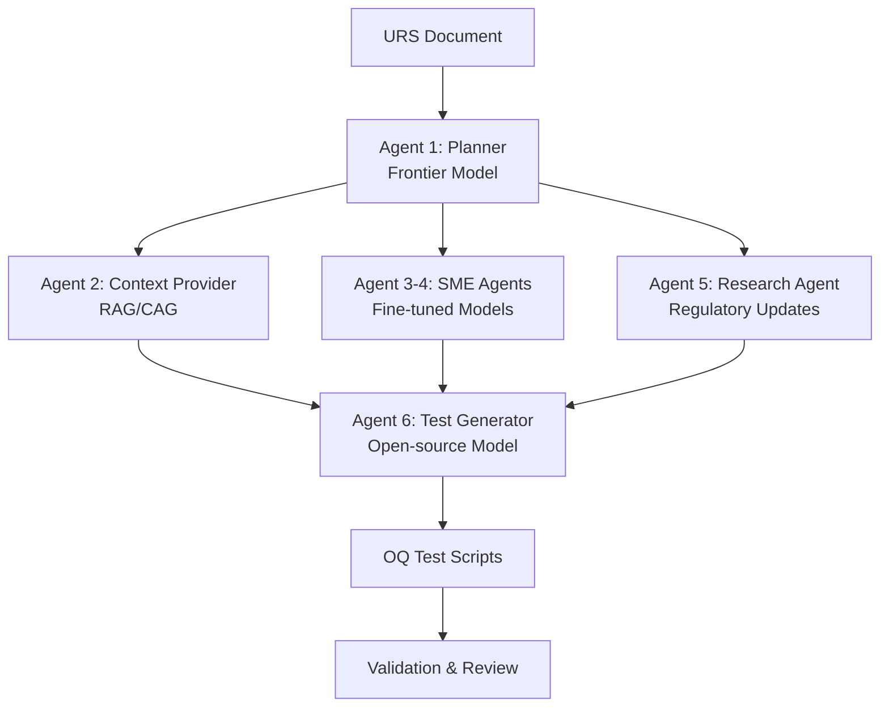

# 🧪 LLM-Driven Test Generation for Computerised System Validation

## 📚 Thesis Project Overview

This project implements a **multi-agent LLM system** for generating Operational Qualification (OQ) test scripts from User Requirements Specifications (URS) in the pharmaceutical/life sciences domain. It addresses the critical challenge of automating Computerised System Validation (CSV) while maintaining regulatory compliance and security.

**Research Title**: *Evaluating Efficiency Gains and Security of LLM-Driven Test Generation for Computerised System Validation: A Compliance-Focused Analysis of Life Sciences Testing Processes*

## 🎯 Project Goals

1. **Efficiency**: Achieve 70% reduction in test script generation time
2. **Compliance**: Ensure 100% adherence to GAMP 5 and 21 CFR Part 11
3. **Security**: Implement OWASP LLM Top 10 risk mitigation
4. **Quality**: Maintain ≥90% requirements coverage with <5% false positives

## 🏗️ Architecture

### Multi-Agent System Design



### Key Components

- **Planner Agent**: Orchestrates workflow using frontier model (GPT-4)
- **Context Agent**: Provides relevant documentation via RAG/CAG
- **Specialist Agents**: Domain-specific expertise (fine-tuned models)
- **Research Agent**: Fetches latest regulatory updates
- **Generator Agent**: Produces compliant test scripts
- **Validation Layer**: ALCOA+ and security compliance checks

## 🚀 Quick Start

### Prerequisites

```bash
# Python 3.12+
python --version

# UV package manager
pip install uv

# Docker (for containerization)
docker --version
```

### Installation

```bash
# Clone repository
cd thesis_project

# Create virtual environment
uv venv
source .venv/bin/activate  # On Windows: .venv\Scripts\activate

# Install dependencies
uv pip install -e .

# Copy environment configuration
cp .env.example .env
# Edit .env with your API keys
```

### Basic Usage

```bash
# Run the test generation workflow
python -m src.main --urs-file path/to/urs.txt

# Interactive mode with Gradio UI
python -m src.main --interactive

# With monitoring
python -m phoenix.server.main serve &
python -m src.main --interactive --enable-monitoring
```

## 🛠️ Development Workflow

### PRP Framework Integration

This project uses the **Product Requirement Prompt (PRP)** framework for structured development:

```bash
# Create a new feature PRP
/create-base-prp "Add ALCOA+ validation module"

# Execute the PRP
/execute-base-prp PRPs/alcoa-validation.md

# Review changes
/review-staged-unstaged
```

### Testing

```bash
# Run all validation gates
make validate

# Individual validation levels
uv run ruff check --fix        # Level 1: Syntax
uv run mypy .                  # Level 1: Types
uv run pytest tests/ -v        # Level 2: Unit tests
uv run python -m src.main test # Level 3: Integration
```

## 📊 Evaluation Methodology

### Cross-Validation Protocol

- **Dataset**: 10-15 diverse URS documents
- **Method**: k-fold cross-validation (k=5)
- **Metrics**: Time reduction, coverage, compliance scores

### Performance Benchmarks

| Metric | Target | Current |
|--------|---------|---------|
| Generation Time | -70% | TBD |
| Requirements Coverage | ≥90% | TBD |
| False Positive Rate | <5% | TBD |
| ALCOA+ Compliance | 100% | TBD |

## 🔒 Security & Compliance

### OWASP LLM Top 10 Mitigations

1. **Prompt Injection**: StruQ structured queries
2. **Data Poisoning**: Isolated training environments
3. **Output Handling**: Llama Guard integration
4. **Access Control**: Zero-trust architecture

### Regulatory Alignment

- **GAMP 5**: Risk-based validation approach
- **21 CFR Part 11**: Electronic signatures & audit trails
- **ALCOA+**: Data integrity principles
- **ISO/IEC 27001**: Information security management

## 📁 Project Structure

```
thesis_project/
├── src/                    # Source code
│   ├── agents/            # Multi-agent components
│   ├── core/              # Workflow orchestration
│   ├── rag/               # RAG/CAG implementation
│   ├── security/          # Security validators
│   └── validation/        # Compliance checks
├── PRPs/                  # PRP documents
│   ├── templates/         # PRP templates
│   └── completed/         # Executed PRPs
├── tests/                 # Test suites
├── docs/                  # Documentation
└── .claude/               # Claude Code commands
```

## 🔬 Research Contributions

1. **First quantitative evaluation** of LLM efficiency in pharmaceutical CSV
2. **Novel security framework** for LLM-generated validation artifacts
3. **Compliance-aware AI architecture** for regulated industries
4. **Open-source implementation** with reproducible benchmarks

## 📈 Monitoring & Observability

```bash
# Start Phoenix monitoring
docker-compose -f phoenix/docker-compose.yml up -d

# View traces
open http://localhost:6006

# Export metrics
python -m src.monitoring.export --format csv
```

## 🤝 Contributing

This is an academic research project. Contributions should align with thesis objectives:

1. Follow PRP methodology for changes
2. Maintain regulatory compliance
3. Document security considerations
4. Include comprehensive tests

## 📚 References

- ISPE (2022). *GAMP 5: A Risk-Based Approach to Compliant GxP Computerized Systems*
- OWASP (2023). *Top 10 for Large Language Model Applications*
- FDA (2022). *Computer Software Assurance Draft Guidance*

## 📝 License

This project is part of academic research. See [LICENSE](LICENSE) for details.

## 👤 Author

**Daniil** - MSc Digital Health Leadership candidate

---

*This project integrates the PRP (Product Requirement Prompt) framework for enhanced AI-assisted development. For more information, see [PRPs/ai_docs/prp_methodology.md](PRPs/ai_docs/prp_methodology.md)*