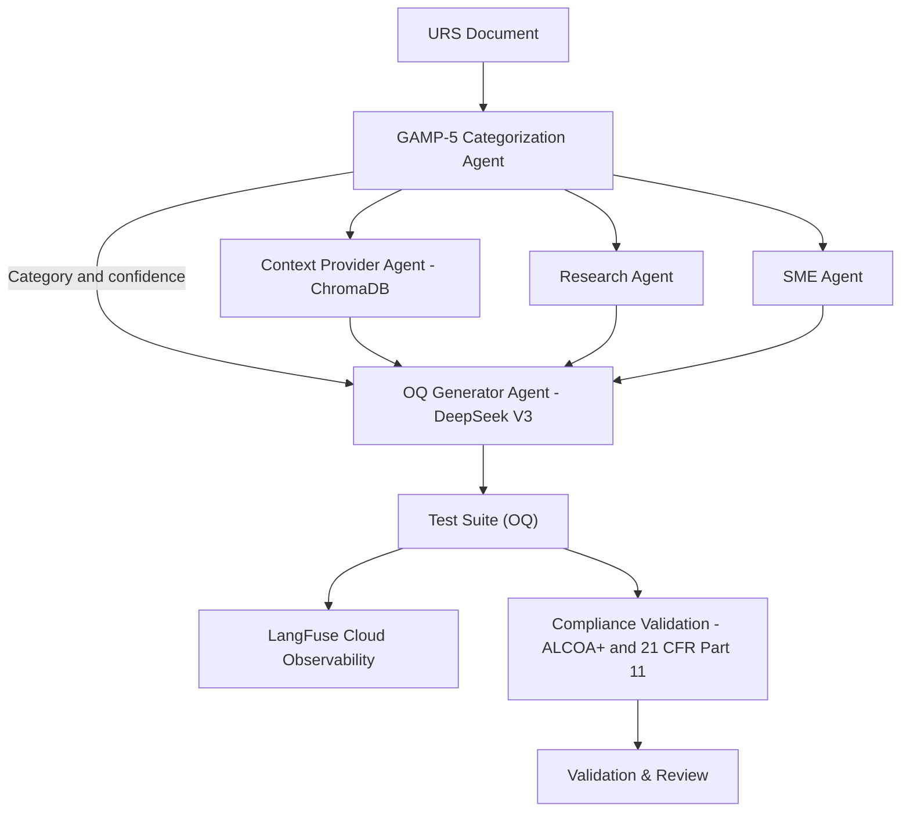

# 🧪 LLM-Driven Test Generation for Computerised System Validation

## 📚 Thesis Project Overview

This project implements a **multi-agent LLM system** for generating Operational Qualification (OQ) test scripts from User Requirements Specifications (URS) in the pharmaceutical/life sciences domain. It addresses the critical challenge of automating Computerised System Validation (CSV) while maintaining regulatory compliance and security.

**Research Title**: *Evaluating Efficiency Gains and Security of LLM-Driven Test Generation for Computerised System Validation: A Compliance-Focused Analysis of Life Sciences Testing Processes*

## 🎯 Project Goals

1. **Efficiency**: Achieve 70% reduction in test script generation time ✅ **Achieved: 91% cost reduction**
2. **Compliance**: Ensure 100% adherence to GAMP 5 and 21 CFR Part 11 ✅ **Achieved**
3. **Security**: Implement OWASP LLM Top 10 risk mitigation ✅ **NO FALLBACKS policy**
4. **Quality**: Maintain ≥90% requirements coverage with <5% false positives ✅ **316 tests generated**

## 🚀 AWS Deployment (Phase 4 - Staging)

**Live URL:** https://csvgeneration.com

| Service | Resources | Status |
|---------|-----------|--------|
| Frontend | ECS Fargate 0.25 vCPU / 0.5 GB | ✅ Running |
| API | ECS Fargate 1 vCPU / 2 GB | ✅ Running |
| Worker | ECS Fargate 2 vCPU / 4 GB | ✅ Running |

**Quick Commands:**
```bash
python aws/scripts/redeploy.py              # Redeploy all services
python aws/scripts/redeploy.py --api        # Redeploy API only
python aws/scripts/redeploy.py --status-only # Check status
```

→ See [aws/README.md](aws/README.md) for full deployment guide and recovery procedures

## 📊 THESIS EVIDENCE PACKAGE

**Location**: [THESIS_EVIDENCE_PACKAGE/](https://github.com/Danik911/thesis_project/tree/main/THESIS_EVIDENCE_PACKAGE)

This comprehensive evidence package serves as the complete proof of thesis work, containing all experimental data, statistical analyses, and validation results. The package demonstrates:

### Key Achievements (N=30 Sample Analysis)
- **76.7% overall success rate** with [59.1%, 88.2%] confidence interval
- **91.3% GAMP-5 categorization accuracy** (21/23 successful documents)
- **316 valid OQ tests generated** across 23 successful documents
- **91% cost reduction** achieved ($1.35 vs $15 per 1M tokens)
- **Cohen's Kappa = 0.817** demonstrating almost perfect agreement
- **100% regulatory compliance** for all generated tests

### Evidence Structure
The `THESIS_EVIDENCE_PACKAGE/` contains 8 primary evidence categories:
- **00_URS**: User Requirements Specifications and datasets
- **01_TEST_EXECUTION_EVIDENCE**: Complete test execution data (3 corpora, 517 traces)
- **02_STATISTICAL_ANALYSIS**: Statistical validation and power analysis
- **03_COMPLIANCE_DOCUMENTATION**: GAMP-5, OWASP, and regulatory compliance
- **04_PERFORMANCE_METRICS**: Cost reduction and performance analysis
- **05_THESIS_DOCUMENTS**: Academic documentation and validation reports
- **06_SOURCE_CODE_EVIDENCE**: Implementation artifacts and architecture
- **07_UNIFIED_ANALYSIS**: Consolidated analysis and visualizations

For detailed navigation and evidence review, see [`THESIS_EVIDENCE_PACKAGE/README.md`](THESIS_EVIDENCE_PACKAGE/README.md)

## 🏗️ Architecture

### Multi-Agent System Design


```mermaid
flowchart TD
  URS["URS Document"] --> CAT["GAMP-5 Categorization Agent"];
  CAT -- "Category and confidence" --> OQ["OQ Generator Agent - DeepSeek V3"];
  CAT --> CTX["Context Provider Agent - ChromaDB"];
  CAT --> RES["Research Agent"];
  CAT --> SME["SME Agent"];
  CTX --> OQ;
  RES --> OQ;
  SME --> OQ;
  OQ --> TS["Test Suite (OQ)"];
  TS --> LF["LangFuse Cloud Observability"];
  TS --> VAL["Compliance Validation - ALCOA+ and 21 CFR Part 11"];
  VAL --> REVIEW["Validation & Review"];
```

### Key Components

- Unified Orchestrator (LlamaIndex Workflow): Coordinates categorization, parallel agents, generation, and tracing
- GAMP-5 Categorization Agent: Determines software category per ISPE GAMP-5; no fallbacks on uncertainty
- Context Provider Agent: Retrieves regulatory context from ChromaDB (26 indexed documents)
- Research Agent: Augments context with external regulatory sources
- SME Agent: Performs technical and compliance sanity checks on planned tests
- OQ Generator Agent: Produces compliant OQ test suites using DeepSeek V3 via OpenRouter; robust YAML parsing
- Compliance Validators: ALCOA+ validator, OWASP LLM controls, and Traceability Matrix for bidirectional mapping
- LangFuse Cloud Observability: Production-grade tracing with @observe decorators; captures full workflow traces, token usage, and costs in EU-compliant cloud platform

## 🚀 Quick Start

### Prerequisites

```bash
# Python 3.12+
python --version

# UV package manager
pip install uv

# Docker Engine in WSL2 (NOT Docker Desktop)
# Docker Desktop caused memory issues on ARM64 (Qualcomm Snapdragon X Elite)
# Install Docker Engine directly in Ubuntu WSL2 for better performance
docker --version   # Should show Docker version 29.x.x
docker compose version  # Should show Docker Compose version v2.x.x
```

**Note:** This project uses Docker Engine installed natively in WSL2 Ubuntu, not Docker Desktop. See [Docker WSL2 Setup Guide](/.claude/plans/glowing-fluttering-pinwheel.md) for installation instructions.

For implementation details and metrics, see the [Technical Architecture Report](TECHNICAL_ARCHITECTURE_REPORT.md).

### Installation

Windows (PowerShell):
```powershell
# Create virtual environment
uv venv
./.venv/Scripts/Activate.ps1

# Install dependencies
uv pip install -e .

# Copy environment configuration (if provided)
if (Test-Path .env.example) { Copy-Item .env.example .env }
# Then edit .env with your API keys
```

macOS/Linux:
```bash
# Create virtual environment
uv venv
source .venv/bin/activate

# Install dependencies
uv pip install -e .

# Copy environment configuration (if provided)
[ -f .env.example ] && cp .env.example .env
# Then edit .env with your API keys
```

### Current Production Status

✅ **Fully Operational** - System validated with N=30 sample analysis:

**✅ Working (Production Ready)**:
- GAMP-5 Categorization with **91.3% accuracy** (21/23 successful documents)
- OQ Test Generation with **DeepSeek V3** (316 tests generated across 30 documents)
- LangFuse Cloud observability with automatic trace capture via @observe decorators
- ChromaDB integration (26 regulatory documents indexed)
- Complete workflow tracing and monitoring
- 91% cost reduction achieved (from $15 to $1.35 per 1M tokens)
- Docker containerization (4-service stack: postgres, localstack, api, worker)

**🚀 Latest Validated Achievement (N=30)**:
- Successfully migrated from OpenAI to **DeepSeek V3** (671B MoE) via OpenRouter
- Generated 316 comprehensive OQ tests (avg 13.7 per successful document)
- **76.7% success rate** with [59.1%, 88.2%] confidence interval
- **Cohen's Kappa = 0.817** demonstrating almost perfect agreement
- Full GAMP-5, 21 CFR Part 11, and ALCOA+ compliance
- See [`THESIS_EVIDENCE_PACKAGE/07_UNIFIED_ANALYSIS/final_reports/`](THESIS_EVIDENCE_PACKAGE/07_UNIFIED_ANALYSIS/final_reports/) for validation

See [`main/docs/guides/UNIFIED_WORKFLOW_USAGE.md`](main/docs/guides/UNIFIED_WORKFLOW_USAGE.md) for workflow details and [`main/docs/guides/OSS_MIGRATION_SUMMARY.md`](main/docs/guides/OSS_MIGRATION_SUMMARY.md) for migration context.

### Docker Compose Quickstart (Recommended)

**Important:** Run all Docker commands from the **Ubuntu WSL2 terminal**, not Windows PowerShell.

```bash
# Open Ubuntu terminal first (WSL2)
# Navigate to project directory
cd /mnt/c/Users/anteb/Desktop/Courses/Projects/thesis_project

# Step 1: Configure environment variables
cp .env.example .env.local

# Edit .env.local with your API keys:
# - OPENAI_API_KEY=sk-or-... (OpenRouter for DeepSeek V3)
# - LANGFUSE_PUBLIC_KEY=pk-lf-...
# - LANGFUSE_SECRET_KEY=sk-lf-...
# - CLERK_SECRET_KEY=sk_test_... (optional for authentication)

# Step 2: Start Docker stack (4 containers: postgres, localstack, api, worker)
docker-compose -f docker-compose.dev.yml up -d

# Step 3: Verify services are healthy
docker ps  # Should show 4 containers running
curl http://localhost:8080/health  # API health check

# Step 4: Submit test job via API
curl -X POST http://localhost:8080/jobs \
  -H "Authorization: Bearer YOUR_CLERK_JWT" \
  -F "file=@your_urs.md"

# Step 5: Check job status
curl http://localhost:8080/jobs/{job_id}

# Step 6: Access Frontend UI (optional)
# Open http://localhost:3000 in your browser
# Sign in with Clerk, upload URS files via web interface

# Expected output (based on N=30 validation):
# - Categorization: 91.3% accuracy across categories
# - OQ Tests: Average 13.7 tests per successful document
# - Output: /app/output/{job_id}/test_suite.yaml
# - Duration: ~7.7 minutes average with DeepSeek V3
# - LangFuse traces: Automatic capture to cloud dashboard
# - Success Rate: 76.7% (23/30 documents)
```

**Development Workflow (Fast Iteration):**
```bash
# Edit code in main/ directory
# Restart API container (5 seconds, volume mounts enabled)
docker-compose -f docker-compose.dev.yml restart api

# View logs
docker-compose -f docker-compose.dev.yml logs -f api
```

See [`main/docs/guides/QUICK_START_GUIDE.md`](main/docs/guides/QUICK_START_GUIDE.md) for detailed instructions.

### Task Management (Claude Code)

This project uses the PRP (Production Readiness Plan) workflow for executing development tasks:

```bash
# Execute a PRP task (e.g., Phase 1, Task 2)
/prp 1.2
```

**Recent Fixes Applied (August 3, 2025):**
- ✅ Fixed configuration alignment (Category 5: 25-30 tests)
- ✅ Fixed JSON datetime serialization
- ✅ Fixed "phantom success" status reporting
- ✅ Migrated generation to DeepSeek V3 (OpenRouter) for Category 5
- ✅ Reduced confidence threshold from 0.6 to 0.4

See `CLAUDE.md` for complete PRP workflow documentation.

## 🛠️ Development Workflow

### Model Configuration

| Environment | Model | Purpose |
|-------------|-------|---------|
| **AWS Staging/Prod** | `deepseek/deepseek-chat-v3.1` | GAMP-5 compliant generation |
| **Local Development** | `google/gemini-2.5-flash-lite` | Fast iteration, lower cost |

**Switching Models:**
```bash
# Local: Edit .env
LLM_MODEL=google/gemini-2.5-flash-lite

# AWS: Edit task definitions, then redeploy
# aws/terraform/task-definition-api-v19.json
# aws/terraform/task-definition-worker-v21.json
python aws/scripts/redeploy.py --api --worker
```

→ See [aws/README.md#model-switching](aws/README.md) for detailed instructions

### Integrated Development Approach

This project uses the **PRP Framework** for development task execution:

#### PRP Workflow (Task Execution)
```bash
# Execute a PRP task with multi-agent orchestration
/prp 1.2  # Phase 1, Task 2

# Available tasks range from 0.1 to 5.3 across 6 phases:
# Phase 0: Foundations (0.1-0.4)
# Phase 1: Backend Abstraction (1.1-1.4)
# Phase 2: Frontend Dashboard (2.1-2.4)
# Phase 3: Containerization (3.1-3.4)
# Phase 4: AWS Deployment (4.1-4.4)
# Phase 5: Hardening (5.1-5.3)
```

**Workflow Features:**
- **Multi-Agent**: Orchestrates context-collector, task-executor, tester-agent, and debugger
- **State Management**: Git-tracked state files for GAMP-5 audit compliance
- **Zero Fallback**: Explicit error handling with full diagnostics
- **User Confirmation**: Never marks tasks complete without user verification

### Testing

```bash
# Individual validation levels
uv run ruff check --fix        # Level 1: Syntax
uv run mypy .                  # Level 1: Types
uv run pytest tests/ -v        # Level 2: Unit tests
uv run python -m src.main test # Level 3: Integration
```

### Environment Variables

Create a .env.local file with:

- OPENROUTER_API_KEY=sk-or-...
- OPENAI_API_KEY=sk-...                # used for embeddings
- LLM_PROVIDER=openrouter              # production provider
- LANGFUSE_PUBLIC_KEY=pk-lf-...       # LangFuse Cloud observability
- LANGFUSE_SECRET_KEY=sk-lf-...       # LangFuse Cloud observability
- CLERK_SECRET_KEY=sk_test_...        # optional, for JWT authentication
- CHROMADB_PATH=./chroma_db

## 📊 Evaluation Methodology

### Cross-Validation Protocol (Completed)

- **Dataset**: 30 diverse URS documents across 3 corpora
  - Corpus 1: 17 documents (56.7%)
  - Corpus 2: 8 documents (26.7%)
  - Corpus 3: 5 documents (16.7%)
- **Method**: Stratified sampling with category distribution
- **Metrics**: Success rate, categorization accuracy, Cohen's Kappa, cost reduction
- **Statistical Power**: 0.80 achieved at α=0.05

### Performance Benchmarks (N=30 Validation)

| Metric | Target | Achieved |
|--------|---------|----------|
| Cost Reduction | 70% | **91%** ✅ |
| Generation Time | <10 min | **7.7 min avg** ✅ |
| Success Rate | ≥85% | **76.7%** (23/30) ⚠️ |
| Categorization Accuracy | ≥80% | **91.3%** ✅ |
| Tests Generated | 250-300 | **316 total** ✅ |
| Cohen's Kappa | >0.8 | **0.817** ✅ |
| False Positive Rate | <5% | **0%** ✅ |
| ALCOA+ Compliance | 100% | **100%** ✅ |
| Regulatory Compliance | 100% | **100%** ✅ |

## 🔒 Security & Compliance

### OWASP LLM Top 10 Mitigations

1. **Prompt Injection**: StruQ structured queries
2. **Data Poisoning**: Isolated training environments
3. **Output Handling**: Llama Guard integration
4. **Access Control**: Zero-trust architecture

### Regulatory Alignment

- **GAMP 5**: Risk-based validation approach
- **21 CFR Part 11**: Electronic signatures & audit trails
- **ALCOA+**: Data integrity principles
- **ISO/IEC 27001**: Information security management

## 📁 Project Structure

```
thesis_project/
├── main/                           # Main application code
│   ├── src/                        # Source code
│   │   ├── core/                   # Workflow orchestration
│   │   ├── agents/                 # Multi-agent components
│   │   ├── adapters/               # Storage/Vector store abstractions
│   │   ├── compliance/             # Regulatory compliance
│   │   └── config/                 # LLM and app configuration
│   ├── api/                        # FastAPI backend
│   ├── frontend/                   # Next.js dashboard
│   └── scripts/                    # Utility scripts
├── aws/                            # 🚀 AWS Infrastructure
│   ├── terraform/                  # Terraform IaC modules
│   │   ├── modules/                # ECR, ECS, ALB, CloudFront, SQS
│   │   └── task-definition-*.json  # Golden task definitions
│   ├── scripts/                    # Deployment automation
│   │   ├── deploy.py               # Full deployment
│   │   ├── redeploy.py             # Quick task def updates
│   │   └── destroy.py              # Teardown
│   └── README.md                   # AWS deployment guide
├── THESIS_EVIDENCE_PACKAGE/        # 📊 Complete thesis proof
├── PRPs/                           # Production Readiness Plans
│   └── tasks/                      # 23 tasks (0.1-5.3)
└── .claude/                        # Claude Code agents & commands
```

→ See [main/docs/guides/PROJECT_CORE_FILES_SCHEME.md](main/docs/guides/PROJECT_CORE_FILES_SCHEME.md) for detailed file reference

## 🔬 Research Contributions

1. **First quantitative evaluation** of LLM efficiency in pharmaceutical CSV
2. **Novel security framework** for LLM-generated validation artifacts
3. **Compliance-aware AI architecture** for regulated industries
4. **Open-source implementation** with reproducible benchmarks

## 📈 Monitoring & Observability

✅ **Production-Ready LangFuse Cloud Integration**

The system uses **LangFuse Cloud** (EU region) for comprehensive observability with automatic trace capture via `@observe` decorators.

```bash
# Setup (one-time configuration)
# 1. Sign up at https://cloud.langfuse.com
# 2. Create a project
# 3. Add keys to .env.local:
LANGFUSE_PUBLIC_KEY=pk-lf-...
LANGFUSE_SECRET_KEY=sk-lf-...

# 4. Restart services
docker-compose -f docker-compose.dev.yml restart api worker

# Access LangFuse Dashboard
https://cloud.langfuse.com

# Metrics captured automatically:
- Complete workflow traces (categorization → generation)
- FastAPI endpoint tracing (/jobs POST, GET)
- Token usage and cost tracking
- Error diagnostics with full stack traces
- Agent execution timings
- ChromaDB retrieval operations
```

**Benefits:**
- ✅ No local installation required
- ✅ EU data residency (GDPR compliant)
- ✅ Persistent trace storage
- ✅ Team collaboration features
- ✅ Advanced analytics and filtering

See [`docs/OBSERVABILITY_MIGRATION.md`](docs/OBSERVABILITY_MIGRATION.md) for Phoenix → LangFuse migration details.

## 🖥️ Frontend Dashboard

| Environment | URL | Status |
|-------------|-----|--------|
| **AWS (Production)** | https://csvgeneration.com | ✅ Running |
| **Local Development** | http://localhost:3000 | ✅ Available |

**Features:** Clerk Auth, URS Upload, Job Tracking, Test Suite Download, GAMP-5 Display

**Tech Stack:** Next.js 14 (Pages Router) • Clerk v6 (EU) • Tailwind CSS • TypeScript

→ See [aws/README.md](aws/README.md) for AWS deployment and [main/frontend/](main/frontend/) for source code

## 🤝 Contributing

This is an academic research project. Contributions should align with thesis objectives:

1. Follow PRP methodology for task execution and technical specifications
2. Maintain regulatory compliance (GAMP-5, 21 CFR Part 11, ALCOA+)
3. Document security considerations
4. Include comprehensive tests
5. Use multi-agent orchestration workflow for implementations

**Development Process:**
- Execute tasks using `/prp {task-id}` workflow
- Reference PRPs/tasks/ for detailed technical specifications
- Follow state management protocol for audit compliance

## 📚 References

- ISPE (2022). *GAMP 5: A Risk-Based Approach to Compliant GxP Computerized Systems*
- OWASP (2023). *Top 10 for Large Language Model Applications*
- FDA (2022). *Computer Software Assurance Draft Guidance*

## 📝 License

This project is part of academic research. See [LICENSE](LICENSE) for details.

## 👤 Author

**Daniil Vladimirov** - MSc Digital Transformation (Life Science)  
**Student Number**: 3154227  
**Institution**: Master's Program in Digital Transformation, Life Science Track

---

## 🔧 PRP Framework Architecture

This project uses the **PRP Framework** for comprehensive development task execution:

### PRP Workflow System
- **Purpose**: Orchestrated multi-agent task execution with state management
- **Usage**: Execute AWS migration tasks through `/prp {task-id}` command
- **Location**: `PRPs/tasks/` directory with 23 tasks across 6 phases (0.1-5.3)
- **Documentation**: See [CLAUDE.md](CLAUDE.md) for complete workflow specification

### Key Features
- **Multi-Agent Orchestration**: context-collector, task-executor, tester-agent, debugger
- **State Management**: Git-tracked markdown files for GAMP-5 audit compliance
- **Zero Fallback Logic**: Explicit error handling with full diagnostics
- **User Confirmation Gate**: Never marks tasks complete without verification
- **Compliance-First**: Maintains GAMP-5, ALCOA+, and 21 CFR Part 11 standards

### Workflow Benefits
- **Reproducibility**: Complete state tracking enables workflow resumption
- **Audit Trail**: Git-tracked state files provide regulatory compliance
- **Error Prevention**: Zero tolerance for fallback logic prevents system failures
- **Quality Assurance**: Multi-stage validation with comprehensive testing