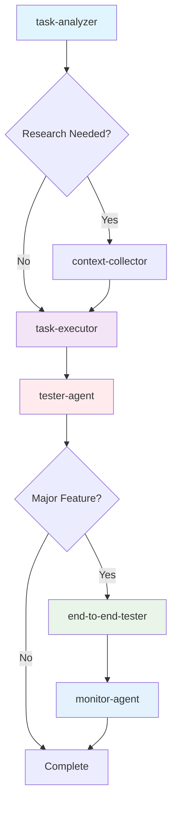

# Multi-Agent Pharmaceutical Workflow System Guide

**Version**: 1.0  
**Date**: July 31, 2025  
**Project**: GAMP-5 Pharmaceutical Test Generation System  

## 🏥 **CRITICAL** Overview

This guide provides comprehensive instructions for using the pharmaceutical multi-agent workflow system with **GAMP-5 compliance**, **Phoenix observability**, and **regulatory audit trails**. The system coordinates 6 specialized agents to deliver complete pharmaceutical software validation workflows.

## 🚨 **ABSOLUTE RULE: NO FUCKING FALLBACKS** 🚨

**ZERO TOLERANCE FOR FALLBACK LOGIC**

- ❌ **NEVER** implement fallback values, default behaviors, or "safe" alternatives
- ❌ **NEVER** mask errors with artificial confidence scores  
- ❌ **NEVER** create deceptive logic that hides real system behavior
- ✅ **ALWAYS** throw errors with full stack traces when something fails
- ✅ **ALWAYS** preserve genuine confidence levels and uncertainties
- ✅ **ALWAYS** expose real system state to users for regulatory compliance

**If something doesn't work - FAIL LOUDLY with complete diagnostic information**

---

# Table of Contents

1. [System Architecture](#system-architecture)
2. [Agent Descriptions](#agent-descriptions)
3. [Workflow Coordination](#workflow-coordination)
4. [Getting Started](#getting-started)
5. [Standard Workflows](#standard-workflows)
6. [Advanced Usage](#advanced-usage)
7. [Monitoring & Observability](#monitoring--observability)
8. [Troubleshooting](#troubleshooting)
9. [Compliance & Validation](#compliance--validation)

---

## System Architecture

### **CRITICAL** Components

The pharmaceutical multi-agent system consists of:

- **6 Specialized Agents**: Each with specific pharmaceutical expertise
- **Workflow Coordinator**: Master orchestrator ensuring context flow
- **Task-Master AI Integration**: Project management and task tracking
- **Phoenix Observability**: Complete monitoring and trace analysis
- **Regulatory Compliance**: GAMP-5, ALCOA+, 21 CFR Part 11 implementation

### **IMPORTANT** Context Management

**KEY PRINCIPLE**: Subagents operate in isolation and cannot share context directly. The main Claude Code instance (root agent) is **CRITICAL** for:
- Providing comprehensive context to each subagent
- Orchestrating workflow sequences
- Ensuring regulatory compliance throughout
- Managing error escalation and recovery

---

## Agent Descriptions

### 1. **task-analyzer** (Initial Analysis)
**Purpose**: Analyzes Task-Master AI tasks, validates dependencies, creates execution documentation  
**When to Use**: **ALWAYS** start with this agent for new tasks  
**Output**: Task analysis, dependency validation, initial documentation  

### 2. **context-collector** (Research Specialist)
**Purpose**: Research specialist for GAMP-5 compliance, LlamaIndex patterns, pharmaceutical standards  
**When to Use**: When additional research or context gathering is needed  
**Output**: Comprehensive research reports, technical context, compliance guidance  

### 3. **task-executor** (Implementation)
**Purpose**: Executes specific Task-Master AI tasks following GAMP-5 compliance patterns  
**When to Use**: For actual implementation work with complete context  
**Output**: Code implementations, feature development, system modifications  
**⚠️ NO FALLBACKS ALLOWED**

### 4. **tester-agent** (Quality Assurance)
**Purpose**: Validates implementations, runs tests, ensures regulatory compliance  
**When to Use**: For validation, testing, and quality assurance  
**Output**: Test results, compliance validation, quality reports  
**⚠️ NO FALLBACKS ALLOWED**

### 5. **end-to-end-tester** (Comprehensive Testing)
**Purpose**: Launches complete pharmaceutical workflow with Phoenix observability, executes comprehensive testing  
**When to Use**: For major features requiring complete workflow validation  
**Output**: End-to-end test reports, workflow performance analysis, honest assessments  

### 6. **monitor-agent** (Observability Analysis) ⭐ **NEW**
**Purpose**: Phoenix observability analysis and monitoring assessment with Puppeteer UI validation  
**When to Use**: **CRITICAL** - AFTER end-to-end-tester for observability validation  
**Output**: Phoenix trace analysis, UI validation screenshots, monitoring compliance reports  
**⚠️ NO FALLBACKS ALLOWED**

### 7. **debugger** (Issue Resolution)
**Purpose**: Advanced debugging with systematic root cause analysis  
**When to Use**: When complex problems occur requiring systematic analysis  
**Output**: Root cause analysis, systematic debugging, architectural recommendations  
**⚠️ NO FALLBACKS ALLOWED**

---

## Workflow Coordination

### **CRITICAL** Standard Workflow Sequence



### **IMPORTANT** Coordination Commands

#### 1. **Manual Agent Coordination**
```bash
# Individual agent execution
Task(subagent_type="task-analyzer", context="...", prompt="...")
Task(subagent_type="context-collector", context="...", prompt="...")
Task(subagent_type="task-executor", context="...", prompt="...")
Task(subagent_type="tester-agent", context="...", prompt="...")
Task(subagent_type="end-to-end-tester", context="...", prompt="...")
Task(subagent_type="monitor-agent", context="...", prompt="...")
```

#### 2. **Workflow Coordinator** (Recommended)
```bash
# Use the workflow coordinator for complete orchestration
Task(subagent_type="workflow-coordinator", 
     context="Complete pharmaceutical development workflow",
     prompt="Coordinate complete workflow for [specific task]")
```

#### 3. **Built-in Commands**
```bash
/coordinate [task_id]     # Complete workflow coordination
/coordinate next          # Get next task and coordinate
/coordinate status        # Show coordination status
/workflow-status          # Quick workflow status check
/escalate [task_id]       # Emergency escalation to debugger
```

---

## Getting Started

### **CRITICAL** Prerequisites

1. **System Setup**:
   ```bash
   # Ensure Phoenix is running
   curl -f http://localhost:6006 && echo "✅ Phoenix ready" || echo "❌ Start Phoenix first"
   
   # Check Task-Master AI integration
   mcp__task-master-ai__get_tasks --status=pending | head -3
   
   # Verify Unicode support (critical for pharmaceutical UI)
   set PYTHONUTF8=1
   ```

2. **Environment Validation**:
   ```bash
   # Dependencies check
   uv run python -c "import openai; print('✅ OpenAI available')"
   uv run python -c "import chromadb; print('✅ ChromaDB available')"
   
   # Phoenix observability check
   curl -s http://localhost:6006/health
   ```

### **IMPORTANT** First Workflow Execution

#### Option 1: Manual Step-by-Step
```bash
# Step 1: Analyze task
Task(subagent_type="task-analyzer", 
     prompt="Analyze task requirements for implementing new pharmaceutical feature")

# Step 2: Gather context (if needed)
Task(subagent_type="context-collector",
     context="[results from task-analyzer]",
     prompt="Research GAMP-5 requirements for the identified feature")

# Step 3: Implementation
Task(subagent_type="task-executor",
     context="[complete context from previous agents]",
     prompt="Implement feature following pharmaceutical compliance requirements")

# Step 4: Testing
Task(subagent_type="tester-agent",
     context="[implementation details]",
     prompt="Validate implementation with comprehensive testing")

# Step 5: End-to-end validation (for major features)
Task(subagent_type="end-to-end-tester",
     context="[testing results]", 
     prompt="Execute complete pharmaceutical workflow validation")

# Step 6: Monitoring analysis
Task(subagent_type="monitor-agent",
     context="[end-to-end test results]",
     prompt="Analyze Phoenix observability and generate monitoring assessment")
```

#### Option 2: Coordinated Workflow (Recommended)
```bash
# Single command for complete coordination
Task(subagent_type="workflow-coordinator",
     prompt="Execute complete pharmaceutical development workflow for [specific requirement]")
```

---

## Standard Workflows

### 1. **New Feature Development**

**Use Case**: Implementing new pharmaceutical validation features

```bash
# Coordinated approach (recommended)
Task(subagent_type="workflow-coordinator",
     prompt="Develop new GAMP-5 categorization enhancement with complete Phoenix observability")

# Manual approach (detailed control)
# 1. Analysis
Task(subagent_type="task-analyzer", 
     prompt="Analyze requirements for new GAMP-5 categorization enhancement")

# 2. Research
Task(subagent_type="context-collector",
     context="[analysis results]",
     prompt="Research latest GAMP-5 guidelines and implementation patterns")

# 3. Implementation  
Task(subagent_type="task-executor",
     context="[complete analysis and research]",
     prompt="Implement GAMP-5 enhancement with compliance attributes")

# 4. Testing
Task(subagent_type="tester-agent",
     context="[implementation details]", 
     prompt="Validate implementation with regulatory compliance testing")

# 5. End-to-end validation
Task(subagent_type="end-to-end-tester",
     context="[testing results]",
     prompt="Execute complete pharmaceutical workflow with new enhancement")

# 6. Monitoring validation
Task(subagent_type="monitor-agent",
     context="[workflow execution results]",
     prompt="Analyze Phoenix traces and validate monitoring effectiveness")
```

### 2. **Bug Fixes and Issues**

**Use Case**: Resolving system issues or bugs

```bash
# For complex issues requiring debugging
Task(subagent_type="debugger",
     prompt="Systematically debug and resolve [specific issue] with full root cause analysis")

# Follow-up with testing
Task(subagent_type="tester-agent",
     context="[debugging results and fixes]",
     prompt="Validate bug fixes with comprehensive regression testing")
```

### 3. **Monitoring and Observability Analysis**

**Use Case**: Analyzing Phoenix observability after workflow execution

```bash
# Monitor-agent for observability analysis
Task(subagent_type="monitor-agent",
     context="Recent workflow execution completed at [timestamp]",
     prompt="Analyze Phoenix observability data and generate comprehensive monitoring assessment with UI validation")
```

### 4. **Research and Context Gathering**

**Use Case**: Gathering information about pharmaceutical standards or technical implementations

```bash
# Research specialist
Task(subagent_type="context-collector",
     prompt="Research latest FDA guidance on computerized systems validation and GAMP-5 implementation patterns")
```

---

## Advanced Usage

### **CRITICAL** Context Management Best Practices

1. **Always Provide Complete Context**:
   ```bash
   # ✅ Good - Complete context
   Task(subagent_type="task-executor",
        context="Task analysis: [complete results], Research findings: [complete findings], Dependencies: [validated], Compliance requirements: [GAMP-5 specific]",
        prompt="Implement solution with provided context")
   
   # ❌ Bad - Incomplete context
   Task(subagent_type="task-executor",
        prompt="Implement solution")
   ```

2. **Maintain Compliance Throughout**:
   ```bash
   # Include pharmaceutical compliance in every agent call
   context="GAMP-5 Category 5 system, ALCOA+ required, 21 CFR Part 11 compliance, NO FALLBACKS allowed"
   ```

3. **Error Escalation Pattern**:
   ```bash
   # If any agent fails, escalate to debugger
   Task(subagent_type="debugger",
        context="[Complete context of failure including all previous agent results]",
        prompt="Systematically debug failure with full diagnostic analysis")
   ```

### **IMPORTANT** Task-Master AI Integration

```bash
# Get next task from Task-Master AI
mcp__task-master-ai__next_task

# Update task status
mcp__task-master-ai__set_task_status --id=X --status=in-progress

# Research integration
mcp__task-master-ai__research --query="..." --taskIds="X,Y"

# Complete coordination workflow
Task(subagent_type="workflow-coordinator",
     prompt="Execute Task-Master AI task [task_id] with complete pharmaceutical workflow")
```

### Phoenix Observability Integration

```bash
# Ensure Phoenix is running before workflows
curl -f http://localhost:6006/health

# After workflow execution, analyze observability
Task(subagent_type="monitor-agent",
     context="Workflow completed with Phoenix tracing active",
     prompt="Generate comprehensive Phoenix observability analysis with Puppeteer UI validation")
```

---

## Monitoring & Observability

### **CRITICAL** Phoenix Integration

The monitor-agent provides comprehensive Phoenix observability analysis:

#### **Features**:
- **Phoenix UI Analysis**: Puppeteer-based interaction with Phoenix interface
- **Screenshot Evidence**: Visual validation of traces and compliance attributes
- **API Cross-Validation**: Comparing UI data with API responses
- **Performance Monitoring**: UI responsiveness and trace collection efficiency
- **Compliance Validation**: GAMP-5, ALCOA+, 21 CFR Part 11 attribute verification

#### **Usage Pattern**:
```bash
# 1. Execute workflow with Phoenix observability
Task(subagent_type="end-to-end-tester",
     prompt="Execute pharmaceutical workflow with Phoenix tracing")

# 2. Analyze observability data
Task(subagent_type="monitor-agent", 
     context="[end-to-end test results including Phoenix server status and trace timestamps]",
     prompt="Analyze Phoenix traces with UI validation and generate comprehensive monitoring report")
```

#### **Expected Outputs**:
- Phoenix UI screenshots with trace data
- Comprehensive monitoring assessment report
- Compliance attribute validation
- Performance analysis with specific recommendations
- Visual evidence for regulatory audits

### **IMPORTANT** Monitoring Reports

All monitoring reports are stored in:
```
main/docs/reports/monitoring/
├── phoenix_analysis_YYYY-MM-DD_HHMMSS.md
├── screenshots/
│   ├── phoenix_dashboard.png
│   ├── phoenix_traces_detailed.png
│   └── phoenix_compliance_view.png
└── monitoring_summary_YYYY-MM-DD.md
```

---

## Troubleshooting

### **CRITICAL** Common Issues

#### 1. **Agent Not Found**
```bash
# Error: Agent type 'monitor-agent' not found
# Solution: Reload Claude Code to register new agents
```

#### 2. **Context Missing**
```bash
# Error: Agent execution fails due to missing context
# Solution: Always provide complete context from previous agents
Task(subagent_type="agent-name",
     context="[Complete context including all previous agent results]",
     prompt="...")
```

#### 3. **Phoenix Not Accessible**
```bash
# Error: Phoenix observability analysis fails
# Solution: Ensure Phoenix server is running
curl -f http://localhost:6006/health
docker ps | grep phoenix
```

#### 4. **Unicode Encoding Issues**
```bash
# Error: UnicodeEncodeError in consultation workflow
# Solution: Set UTF-8 environment variable
set PYTHONUTF8=1
```

#### 5. **NO FALLBACKS Violation**
```bash
# Error: Agent implementing fallback behavior
# Solution: Agents MUST fail explicitly with diagnostic information
# Review agent output for masked errors or artificial success reporting
```

### **IMPORTANT** Escalation Process

For complex issues:
```bash
# Emergency escalation to debugger
Task(subagent_type="debugger",
     context="[Complete diagnostic context including all agent execution logs]",
     prompt="Systematically debug critical issue with full root cause analysis")
```

---

## Compliance & Validation

### **CRITICAL** Pharmaceutical Requirements

#### **GAMP-5 Compliance**
- All agents must implement GAMP-5 categorization principles
- Category determination must be explicit and auditable
- NO FALLBACKS: Confidence below threshold requires human consultation

#### **ALCOA+ Data Integrity**
- **Attributable**: User context preserved in all traces
- **Legible**: Human-readable audit trails
- **Contemporaneous**: Real-time event logging
- **Original**: Raw data preservation without modification
- **Accurate**: Precise measurements and calculations
- **Complete**: All operations captured in audit trail
- **Consistent**: Standardized formats and procedures
- **Enduring**: Persistent storage for regulatory timeline
- **Available**: Accessible for regulatory inspections

#### **21 CFR Part 11**
- Electronic records with tamper-evident logging
- Digital signature framework for critical decisions
- Access control and user authentication
- Complete audit trail for all system modifications

### **IMPORTANT** Validation Workflow

```bash
# Complete validation workflow
# 1. Implementation
Task(subagent_type="task-executor", 
     context="GAMP-5 Category 5, ALCOA+ required, 21 CFR Part 11 compliance",
     prompt="Implement pharmaceutical feature with full compliance")

# 2. Quality assurance
Task(subagent_type="tester-agent",
     context="[implementation with compliance requirements]",
     prompt="Validate compliance with comprehensive regulatory testing")

# 3. End-to-end validation
Task(subagent_type="end-to-end-tester",
     context="[tested implementation]", 
     prompt="Execute complete pharmaceutical workflow validation")

# 4. Monitoring compliance
Task(subagent_type="monitor-agent",
     context="[workflow execution results]",
     prompt="Validate observability compliance and generate regulatory monitoring report")
```

---

## **CRITICAL** Success Criteria

The multi-agent workflow is successful ONLY when:

- ✅ **Complete Context Flow**: Each agent receives ALL necessary information
- ✅ **Pharmaceutical Compliance**: GAMP-5, ALCOA+, 21 CFR Part 11 requirements met
- ✅ **NO FALLBACKS**: Explicit error handling with diagnostic information
- ✅ **Audit Trail Completeness**: Full traceability from start to finish
- ✅ **Phoenix Observability**: Comprehensive monitoring with UI validation
- ✅ **Regulatory Readiness**: System suitable for pharmaceutical validation

---

## Quick Reference

### **Essential Commands**
```bash
# Complete coordination
/coordinate next

# Status check
/workflow-status

# Emergency escalation
/escalate last

# Manual workflow
Task(subagent_type="workflow-coordinator", prompt="...")
```

### **Agent Sequence**
```
task-analyzer → context-collector → task-executor → tester-agent → end-to-end-tester → monitor-agent
```

### **Key Directories**
```
.claude/agents/           # Agent definitions
main/docs/reports/        # Generated reports
main/docs/guides/         # This guide
main/logs/               # System logs
```

---

**Last Updated**: July 31, 2025  
**Version**: 1.0  
**Next Review**: August 15, 2025  

**REMEMBER**: This system prioritizes **pharmaceutical compliance over speed**, **complete context sharing over efficiency**, and **systematic coordination over ad-hoc delegation**. Every coordination decision impacts patient safety and regulatory compliance.