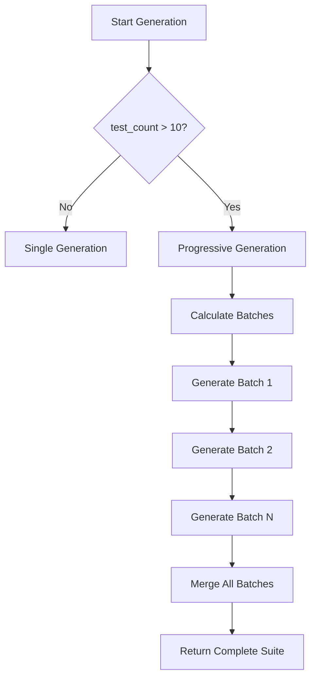

# Issue #004: Progressive Generation Trigger Logic

**Status**: Working but Needs Documentation  
**Severity**: Medium  
**First Observed**: August 6, 2025  
**Components Affected**: OQ Test Generator, o3 model handling

## Problem Description

The progressive generation logic for o3 models has unclear triggering conditions and behavior:
- Triggers at >10 tests for o3 models
- Splits generation into batches
- Not well documented when/why it's needed

## Current Implementation

```python
# In generator_v2.py
if model_name.startswith("o3") and test_count > 10:
    self.logger.info(
        f"Using progressive generation for o3 model with {test_count} tests"
    )
    test_suite = await self._generate_with_progressive_o3_model(
        llm=llm,
        gamp_category=gamp_category,
        urs_content=urs_content,
        document_name=document_name,
        test_count=test_count,
        context_data=context_data
    )
```

## Progressive Generation Details

### Batch Configuration
```python
def _determine_batch_count(self, total_tests: int) -> int:
    """Determine optimal batch count based on total tests."""
    if total_tests <= 10:
        return 1  # Single batch for small sets
    elif total_tests <= 20:
        return 2  # Two batches for medium sets
    elif total_tests <= 30:
        return 3  # Three batches for large sets
    else:
        return 4  # Four batches for very large sets
```

### Why Progressive Generation?

1. **Token Limits**: o3 models have output token constraints
2. **Quality**: Better quality when generating smaller batches
3. **Reliability**: Reduces chance of incomplete JSON responses
4. **Context Management**: Prevents context overflow

## Behavior by Category

| GAMP Category | Typical Tests | Batches | Tests per Batch |
|--------------|---------------|---------|-----------------|
| Category 1   | 5-10         | 1       | 5-10           |
| Category 3   | 10-15        | 2       | 5-8            |
| Category 4   | 15-20        | 2       | 8-10           |
| Category 5   | 25-30        | 3       | 8-10           |

## Evidence of Need

```python
# Without progressive generation (>20 tests):
# - JSON truncation errors
# - Missing test cases
# - Incomplete responses

# With progressive generation:
# - All tests generated successfully
# - Complete JSON structure
# - Better test quality
```

## Implementation Flow



## Configuration Options

```python
class ProgressiveGenerationConfig:
    # Thresholds
    TRIGGER_THRESHOLD = 10  # Start progressive at >10 tests
    MAX_TESTS_PER_BATCH = 10  # Maximum tests in single batch
    
    # Batch sizing
    BATCH_SIZES = {
        "small": 5,   # 5 tests per batch
        "medium": 8,  # 8 tests per batch  
        "large": 10   # 10 tests per batch
    }
    
    # Timeout adjustments
    BATCH_TIMEOUT_MULTIPLIER = 1.5  # Increase timeout for batches
```

## Known Issues

1. **Batch Overlap**: Some test requirements might be duplicated
2. **Context Loss**: Later batches might miss earlier context
3. **ID Management**: Need to ensure unique test IDs across batches

## Optimization Opportunities

1. **Dynamic Batch Sizing**:
```python
def calculate_optimal_batch_size(total_tests, model_limits):
    """Calculate optimal batch size based on model constraints."""
    max_tokens_per_test = 500  # Approximate
    max_output_tokens = model_limits.get('max_completion_tokens', 4000)
    
    optimal_batch = min(
        max_output_tokens // max_tokens_per_test,
        10  # Hard limit
    )
    return optimal_batch
```

2. **Parallel Batch Generation**:
```python
async def generate_batches_parallel(batches):
    """Generate multiple batches in parallel."""
    tasks = [
        generate_batch(batch_num, batch_config)
        for batch_num, batch_config in enumerate(batches)
    ]
    results = await asyncio.gather(*tasks)
    return merge_batch_results(results)
```

3. **Smart Context Propagation**:
```python
def prepare_batch_context(batch_num, previous_results):
    """Include summary of previous batches in context."""
    if batch_num == 0:
        return base_context
    
    context = base_context.copy()
    context['previous_tests'] = summarize_tests(previous_results)
    context['remaining_categories'] = identify_gaps(previous_results)
    return context
```

## Verification

```python
# Test progressive generation
async def test_progressive_generation():
    generator = OQTestGeneratorV2()
    
    # Test with 25 tests (should trigger progressive)
    result = await generator.generate_oq_tests(
        gamp_category=GAMPCategory.CATEGORY_5,
        urs_content="Test URS content",
        document_name="test.txt",
        context_data={},
        config=OQGenerationConfig(target_test_count=25)
    )
    
    assert result.total_test_count == 25
    assert result.generation_metadata.get('method') == 'progressive_o3_generation'
    print(f"✅ Generated {result.total_test_count} tests using progressive generation")
```

## Best Practices

1. **Always use for Category 5**: High test counts benefit from progressive
2. **Monitor batch quality**: Check each batch completes properly
3. **Validate merged results**: Ensure no duplicate IDs
4. **Log batch progress**: Track which batch is being generated

## Future Improvements

1. **Adaptive Triggering**: Based on actual token usage, not test count
2. **Intelligent Batching**: Group related tests together
3. **Retry Logic**: Retry failed batches independently
4. **Caching**: Cache successful batches in case of failure

## Related Issues

- o3 model token limits
- JSON parsing errors with large responses
- Test ID uniqueness across batches

## References

- Progressive generation implementation: `_generate_with_progressive_o3_model()`
- Batch management: `_parse_o3_batch_response()`
- Test merging: `_merge_progressive_results()`

## Notes

Progressive generation significantly improves reliability for large test suites but adds complexity. The current threshold of >10 tests works well in practice but could be optimized based on actual token usage patterns.