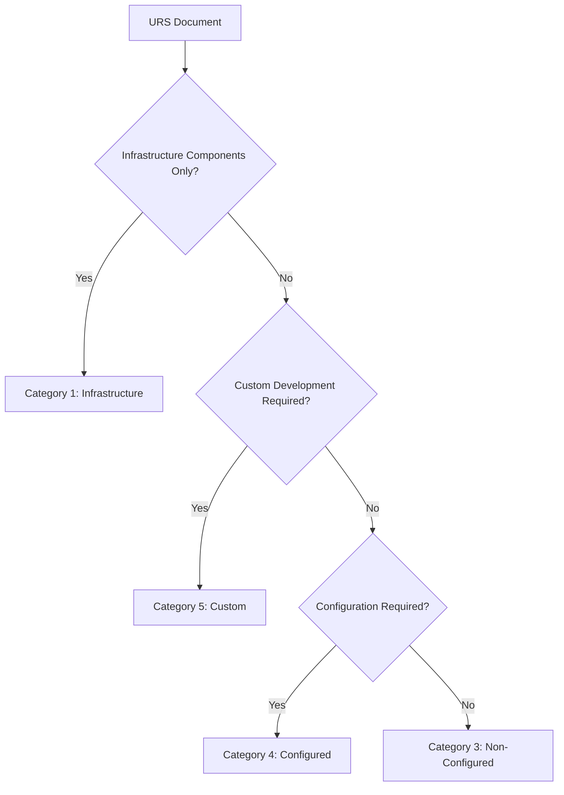

# GAMP-5 Software Categorization: Implementation Synthesis for Task 2.1

## Executive Summary

This document synthesizes the essential GAMP-5 categorization criteria extracted from the ISPE GAMP 5 guidelines to enable automated classification of software systems from User Requirements Specifications (URS). The analysis covers Categories 1, 3, 4, and 5, providing the foundation for implementing a rules-based or ML-driven categorization engine for pharmaceutical validation workflows.

**Document Purpose**: Support implementation of Task 2.1 - Design GAMP-5 Categorization Logic  
**Thesis Context**: Multi-agent system for pharmaceutical test generation (GAMP-5 compliant)  
**Regulatory Alignment**: ISPE GAMP 5 Second Edition (2022), 21 CFR Part 11, EU Annex 11

---

## 1. GAMP-5 Software Categories Overview

The GAMP framework categorizes software based on **complexity**, **configurability**, and **risk** to determine appropriate validation approaches. Understanding these categories is critical for risk-based validation and regulatory compliance.

### 1.1 Category Mapping to Validation Effort

| Category | Validation Effort | Risk Level | Documentation Requirements |
|----------|------------------|------------|---------------------------|
| Category 1 | Minimal | Low | Installation procedures |
| Category 3 | Low-Medium | Medium | Functional verification |
| Category 4 | Medium-High | Medium-High | Configuration testing |
| Category 5 | Comprehensive | High | Full lifecycle documentation |

---

## 2. Detailed Category Analysis

### 2.1 Category 1: Infrastructure Software

#### **Definition**
Operating systems, database engines, programming languages, and network software components that provide the foundational computing environment.

#### **Key Characteristics**
- **Usage Pattern**: Used "as supplied" without modification
- **Configuration Level**: Generally not configured or minimally configured
- **Technology Maturity**: Well-established, proven technology
- **Market Position**: Standard industry components
- **Risk Profile**: Low impact on GxP processes (indirect support)

#### **Identification Criteria for URS Parsing**
```yaml
Infrastructure Indicators:
  - Operating Systems: "Windows", "Linux", "Unix", "macOS"
  - Databases: "Oracle", "SQL Server", "MySQL", "PostgreSQL"
  - Languages: "Java", "Python", "C++", ".NET Framework"
  - Network: "TCP/IP", "HTTP/HTTPS", "FTP", "SMTP"
  - Middleware: "Web servers", "Application servers"
  
Exclusion Patterns:
  - Custom configurations of infrastructure
  - Modified or extended infrastructure components
  - Infrastructure with GxP-critical business logic
```

#### **Examples from URS Documents**
- "System shall operate on Windows Server 2019"
- "Database engine: Oracle 19c Enterprise Edition"
- "Application developed using Java 11 framework"
- "Network communication via standard HTTPS protocols"

#### **Validation Approach**
- **Focus**: Installation Qualification (IQ) and operational procedures
- **Testing Scope**: Installation verification, basic connectivity
- **Documentation**: Installation procedures, system requirements
- **Effort Level**: 5-10% of total validation effort

### 2.2 Category 3: Non-Configured Products

#### **Definition**
Commercial off-the-shelf (COTS) software packages used without modification, configuration, or customization.

#### **Key Characteristics**
- **Modification Level**: No changes to software functionality
- **Configuration**: Used with default or minimal settings
- **Purpose**: Standard industry applications
- **Supplier Involvement**: Minimal - standard product support
- **Implementation**: Direct installation and use

#### **Identification Criteria for URS Parsing**
```yaml
COTS Indicators:
  - "Commercial software"
  - "Standard package"
  - "Off-the-shelf solution"
  - "Vendor standard functionality"
  - "Default configuration"
  - "Standard installation"
  
Product Types:
  - Basic instruments: "balance", "pH meter", "spectrophotometer"
  - Standard tools: "Microsoft Office", "Adobe Acrobat"
  - Simple utilities: "backup software", "antivirus"
  
Exclusion Patterns:
  - Any mention of "configuration", "customization", "modification"
  - User-defined workflows or parameters
  - Integration requirements beyond standard interfaces
```

#### **Examples from URS Documents**
- "Analytical balance with standard weighing functionality"
- "Document management using Adobe Acrobat standard features"
- "Temperature monitoring instrument with default settings"
- "Barcode scanner with standard data collection"

#### **Validation Approach**
- **Focus**: Operational Qualification (OQ) of standard functions
- **Testing Scope**: Standard functionality verification, basic operational tests
- **Documentation**: Operational procedures, user manuals
- **Effort Level**: 15-25% of total validation effort

### 2.3 Category 4: Configured Products

#### **Definition**
Commercial software packages that require configuration to meet specific business needs, where configuration parameters and settings define system behavior.

#### **Key Characteristics**
- **Configurability**: Significant user-defined parameters and settings
- **Standard Base**: Built on established commercial platform
- **Customization Level**: Configuration-driven, not code changes
- **Business Logic**: User-defined workflows and business rules
- **Flexibility**: Adaptable to different business processes

#### **Identification Criteria for URS Parsing**
```yaml
Configuration Indicators:
  - "Configure", "configuration", "configurable"
  - "User-defined parameters"
  - "Workflow configuration"
  - "Business rules setup"
  - "System parameters"
  - "User preferences"
  - "Setup wizard"
  
System Types:
  - LIMS: "sample management", "test protocols", "result workflows"
  - ERP: "business processes", "approval workflows", "reporting"
  - MES: "production workflows", "batch records", "process steps"
  - QMS: "document workflows", "change control", "training records"
  
Configuration Elements:
  - User roles and permissions
  - Approval workflows
  - Business rule engines
  - Reporting templates
  - Interface configurations
```

#### **Examples from URS Documents**
- "LIMS shall be configured for stability testing workflows"
- "ERP system configured for pharmaceutical manufacturing processes"
- "Document management system with configurable approval workflows"
- "MES configured for batch production and electronic records"

#### **Validation Approach**
- **Focus**: Configuration verification and business process testing
- **Testing Scope**: Standard functions + all configured elements
- **Documentation**: Configuration specifications, test protocols, change control
- **Effort Level**: 40-60% of total validation effort

### 2.4 Category 5: Custom Applications

#### **Definition**
Software developed specifically for particular applications, including bespoke systems, custom algorithms, and applications with significant custom code development.

#### **Key Characteristics**
- **Development Type**: Custom software development
- **Code Ownership**: Unique, proprietary code
- **Business Logic**: Custom algorithms and processing
- **Integration**: Often complex system integrations
- **Risk Level**: Highest due to novel functionality

#### **Identification Criteria for URS Parsing**
```yaml
Custom Development Indicators:
  - "Custom development", "bespoke solution"
  - "Proprietary algorithm"
  - "Custom calculations"
  - "Tailored functionality"
  - "Purpose-built application"
  - "Custom integration"
  - "Unique business logic"
  
Technical Indicators:
  - Custom mathematical models
  - Proprietary data processing
  - Novel analytical methods
  - Custom reporting engines
  - Unique user interfaces
  - AI/ML implementations
  
Complexity Markers:
  - "Algorithm development"
  - "Custom data models"
  - "Proprietary methods"
  - "Specialized calculations"
  - "Custom interfaces"
```

#### **Examples from URS Documents**
- "Custom algorithm for drug stability prediction using ML models"
- "Bespoke application for clinical trial data analysis"
- "Proprietary calculation engine for batch yield optimization"
- "Custom integration between multiple legacy systems"

#### **Validation Approach**
- **Focus**: Full software development lifecycle (GAMP V-model)
- **Testing Scope**: Comprehensive testing including unit, integration, system, and user acceptance
- **Documentation**: Complete specifications, design documents, code reviews, comprehensive test documentation
- **Effort Level**: 70-90% of total validation effort

---

## 3. Classification Decision Logic

### 3.1 Primary Decision Tree



### 3.2 Multi-Factor Decision Matrix

| Factor | Cat 1 | Cat 3 | Cat 4 | Cat 5 |
|--------|-------|-------|-------|-------|
| **Code Development** | None | None | None | Required |
| **Configuration Level** | Minimal | None/Minimal | Significant | Variable |
| **Business Logic** | System-level | Standard | Configurable | Custom |
| **Risk to Patient Safety** | Low | Low-Medium | Medium-High | High |
| **Validation Complexity** | Minimal | Low | Medium | High |

### 3.3 Confidence Scoring Algorithm

```python
def calculate_confidence_score(indicators):
    """
    Calculate confidence score for category assignment
    Returns: float between 0.0 and 1.0
    """
    weights = {
        'strong_indicators': 0.4,
        'weak_indicators': 0.2,
        'exclusion_factors': -0.3,
        'ambiguity_penalty': -0.1
    }
    
    score = sum(weights[factor] * count for factor, count in indicators.items())
    return max(0.0, min(1.0, 0.5 + score))
```

---

## 4. Implementation Architecture

### 4.1 URS Document Processing Pipeline

```yaml
Stage 1: Document Preprocessing
  - Text extraction from PDF/Word documents
  - Section identification (functional, technical, interface)
  - Noise removal and normalization

Stage 2: Feature Extraction
  - Keyword identification and scoring
  - Technical term recognition
  - Complexity indicators
  - Risk factor identification

Stage 3: Classification Engine
  - Rules-based classification
  - Confidence scoring
  - Ambiguity detection
  - Multi-category flagging

Stage 4: Validation and Output
  - Human review triggers
  - Audit trail generation
  - Integration with downstream processes
```

### 4.2 Modular Design for Future Enhancement

```python
class GAMPCategorizer:
    def __init__(self):
        self.rules_engine = RulesBasedClassifier()
        self.ml_engine = None  # Future ML implementation
        self.confidence_threshold = 0.85
    
    def categorize(self, urs_document):
        # Primary classification
        category, confidence = self.rules_engine.classify(urs_document)
        
        # Low confidence trigger for human review
        if confidence < self.confidence_threshold:
            return self._request_human_review(urs_document, category, confidence)
            
        return {
            'category': category,
            'confidence': confidence,
            'justification': self._generate_justification(urs_document, category),
            'risk_factors': self._identify_risk_factors(urs_document),
            'validation_scope': self._determine_validation_scope(category)
        }
```

---

## 5. Edge Cases and Mitigation Strategies

### 5.1 Hybrid Systems

**Challenge**: Systems that span multiple categories
**Examples**: 
- COTS software with custom extensions (Cat 3 + Cat 5)
- Configured systems with custom interfaces (Cat 4 + Cat 5)

**Mitigation Strategy**:
- Multi-category detection capability
- Risk-based approach favoring higher category
- Component-level categorization for complex systems

### 5.2 Ambiguous Requirements

**Challenge**: Poorly written or incomplete URS documents
**Indicators**:
- Vague language ("suitable software solution")
- Missing technical details
- Contradictory requirements

**Mitigation Strategy**:
- Confidence scoring with human review triggers
- Template-based URS improvement recommendations
- Iterative classification with stakeholder input

### 5.3 Evolution Scenarios

**Challenge**: Software evolving between categories over time
**Examples**:
- Cat 4 system requiring custom development (→ Cat 5)
- Cat 3 system requiring configuration (→ Cat 4)

**Mitigation Strategy**:
- Version tracking and re-categorization triggers
- Change impact assessment workflows
- Historical categorization audit trails

---

## 6. Regulatory Compliance Mapping

### 6.1 GAMP 5 Alignment

| Category | V-Model Application | Documentation Level | Testing Approach |
|----------|-------------------|-------------------|------------------|
| Cat 1 | Simplified | Minimal | Installation focus |
| Cat 3 | Standard | Moderate | Functional verification |
| Cat 4 | Enhanced | Detailed | Configuration + functional |
| Cat 5 | Full | Comprehensive | Complete SDLC |

### 6.2 FDA 21 CFR Part 11 Requirements

- **Category 1**: Minimal electronic records impact
- **Category 3**: Standard e-signature requirements
- **Category 4**: Configured audit trail and security
- **Category 5**: Full Part 11 compliance including custom controls

### 6.3 EU Annex 11 Risk-Based Approach

The categorization directly supports Annex 11's risk-based validation by:
- Scaling validation effort to system complexity
- Focusing resources on high-risk systems (Cat 5)
- Enabling lean validation for low-risk systems (Cat 1, 3)

---

## 7. Success Metrics and KPIs

### 7.1 Classification Accuracy

- **Target**: >90% accuracy across all categories
- **Measurement**: Manual validation against expert assessment
- **False Positive Rate**: <5% (over-categorization)
- **False Negative Rate**: <3% (under-categorization)

### 7.2 Processing Efficiency

- **Processing Time**: <30 seconds per URS document
- **Automation Rate**: >85% without human intervention
- **Confidence Threshold**: 85% for automatic classification

### 7.3 Validation Impact

- **Category 1**: 70% effort reduction vs. traditional approach
- **Category 3**: 60% effort reduction vs. one-size-fits-all
- **Category 4**: 40% effort optimization through focused testing
- **Category 5**: 30% efficiency gain through early identification

---

## 8. Integration with Multi-Agent System

### 8.1 Workflow Integration

```
URS Document → GAMP Categorizer → Category Output → Planner Agent
                                        ↓
                             Category-Specific Validation Plan
                                        ↓
                    Context/SME/Research Agents (Category-Aware)
                                        ↓
                              Test Generator (Category-Tuned)
                                        ↓
                                 OQ Scripts (Risk-Based)
```

### 8.2 Agent Communication Protocol

```json
{
  "categorizer_output": {
    "category": 4,
    "confidence": 0.92,
    "justification": "System requires LIMS configuration for stability testing workflows",
    "risk_factors": ["gxp_critical", "data_integrity", "configured_workflows"],
    "validation_scope": "configured",
    "recommended_agents": ["context_agent", "sme_agent", "config_specialist"],
    "testing_templates": ["lims_config", "stability_workflows", "data_integrity"],
    "compliance_requirements": ["21cfr11", "ich_q7", "gamp5_cat4"]
  }
}
```

---

## 9. Future Enhancements

### 9.1 Machine Learning Integration

- **Training Data**: 200+ labeled URS documents across all categories
- **Model Architecture**: Transformer-based classification (BERT/RoBERTa)
- **Features**: Text embeddings + engineered features from rules engine
- **Validation**: Cross-validation with expert assessment

### 9.2 Advanced Features

- **Multi-language Support**: Non-English URS documents
- **Document Quality Scoring**: URS completeness assessment
- **Regulatory Change Adaptation**: Updates for evolving GAMP guidance
- **Integration APIs**: Third-party validation tools

---

## 10. Conclusion

This synthesis provides the foundational knowledge and implementation framework for automated GAMP-5 software categorization. The rules-based approach ensures transparency and auditability while providing a pathway for future ML enhancement. The categorization output enables risk-based validation planning, regulatory compliance, and optimal resource allocation across the pharmaceutical validation lifecycle.

**Key Deliverables for Task 2.1**:
✅ Clear criteria for Categories 1, 3, 4, and 5 extracted from GAMP-5  
✅ Rules-based approach for URS document parsing and mapping  
✅ Modular design supporting future updates and ML integration  
✅ Integration framework with existing multi-agent architecture  
✅ Compliance alignment with GAMP 5, 21 CFR Part 11, and EU Annex 11  

---

**Document Metadata**  
- **Created**: [Current Date]  
- **Author**: Multi-agent LLM System Implementation  
- **Version**: 1.0  
- **Classification**: Internal Research Document  
- **Next Review**: Upon task 2.1 completion and validation  

---

*This document forms the basis for implementing the GAMP-5 Categorization Agent as the foundational component of the pharmaceutical validation multi-agent system, ensuring regulatory compliance and risk-based validation from the earliest stages of system assessment.*